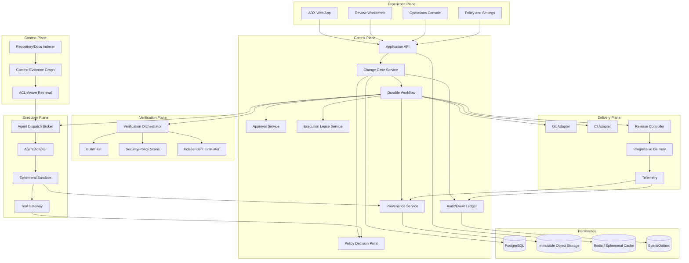

# AutoDev Studio (ADX)
## High-Assurance Implementation Specification: TanStack-Centered, Evidence-First Change Delivery Platform

**Document status:** Implementation-grade target specification  
**Source basis:** AutoDev Studio research/architecture blueprint, v4.2.0-Enterprise  
**Implementation posture:** modular, replaceable adapters, contract-first, evidence-first, risk-adaptive  
**Recommended frontend:** React + TanStack Start + TanStack Router + TanStack Query + TanStack Form + TanStack Table + TanStack Virtual + TanStack Store + TanStack Devtools  
**Recommended backend posture:** independent control-plane services with durable workflow execution, PostgreSQL, immutable object storage, event/outbox, policy engine, ephemeral execution, independent verification, CI/CD and progressive delivery adapters  
**Audience:** staff/principal engineers, architects, platform engineers, security engineers, product designers, SREs, QA/evaluation engineers, coding agents, implementation automation tools  

> **Quality standard.** “World class” is not a marketing assertion. In this specification it means ADX can demonstrate, with repeatable tests and production evidence, that no agent exceeds delegated authority; every material decision is attributable to tamper-evident evidence; and every distributed side effect has a bounded reconciliation or recovery path.

---

## 0. Executive implementation contract

ADX is to be implemented as a **policy-governed software change delivery control plane**. It is not a general-purpose autonomous coding chatbot. The unit of work is a **Change Case**, which moves through explicit, typed, evidence-producing states. The control plane owns authority, policy, approvals, provenance, evidence, and release decisions. Agent runtimes are replaceable execution components.

The source blueprint establishes six lifecycle gates, five risk tiers, immutable evidence principles, and a separation between control, context, execution, verification, delivery, and audit planes. These are retained as the product's non-negotiable architectural spine. fileciteturn0file0L123-L162 fileciteturn0file0L198-L219

The frontend is intentionally **TanStack-centered** because the product needs a strongly typed URL contract, predictable server/client data loading, complex form validation, very large evidence tables, responsive virtualization, and small local reactive state without making a client-side global store the source of truth. TanStack Router recommends file-based routing and provides inferred route/search-parameter types and route-level code splitting; TanStack Start layers SSR, streaming, server functions, middleware and full-stack builds on top of the router. citeturn256381search0turn256381search10turn256381search4

### 0.1 Product principles

1. **Every side effect is authorized.** No agent action, merge, deployment, secret retrieval, or network write occurs merely because an agent requested it.
2. **Every material decision is evidenced.** Human and machine decisions bind to exact artifact digests.
3. **Every state transition is replayable.** Historical evidence is append-only; current state is a projection.
4. **Every integration is an adapter.** GitHub is not the domain model. Temporal is not the workflow model. LangGraph is not the business truth. Argo Rollouts is not the release authority.
5. **Every UI action has a safe failure state.** The user must know whether an action was accepted, rejected, pending, retried, duplicated, or merely queued.
6. **Every risky operation is interruptible.** Cancellation, lease revocation, environment isolation, and rollback are first-class.
7. **Evidence must be independently generated whenever possible.** An implementer does not get to self-certify the implementation.
8. **The URL is part of the application state.** Filters, selected change case, evidence slice, review view, and comparison target should survive reload/share/bookmark where appropriate.
9. **Server state belongs to TanStack Query.** Ephemeral UI state belongs to small local stores or component state. Server state must not be duplicated in a second cache.
10. **Optimization follows measurement.** Performance budgets, traces, and user journeys are acceptance criteria, not post-launch polish.
11. **No external system is assumed correct.** Git, CI, deployment, telemetry, model, and identity providers are eventually consistent dependencies whose state must be authenticated, deduplicated, reconciled, and recorded.
12. **A digest is an identifier, not proof of immutability.** ADX makes evidence tamper-evident through signed attestations, retained raw artifacts, integrity checkpoints, and independent verification.
13. **No generic shell receives ambient authority.** Filesystem, process, network, secret, and cloud boundaries are enforced by the execution substrate and gateway, never by a model instruction alone.

### 0.2 Non-goals for initial implementation

Do not attempt all of the following in v1:

- a universal autonomous software engineer;
- arbitrary production infrastructure execution by agents;
- generalized multi-agent conversations as product state;
- custom normalized client cache infrastructure;
- multi-cloud release orchestration beyond adapter contracts;
- a workflow engine that depends on a single agent framework;
- a promise of defect-free or zero-breakage production deployment.

The source explicitly recommends calibrated autonomy, an event-sourced workflow, typed contracts, separate execution/control planes, and evaluation on organizational work rather than vendor leaderboards. fileciteturn0file0L14-L26

### 0.3 Non-negotiable proof obligations

No stage may be marked complete merely because a demo succeeds. The following proof obligations apply to every production-capable path:

| Property | Required proof |
|---|---|
| Authority | A negative test proves the request is rejected at the backend/substrate when UI and agent instructions are bypassed. |
| Integrity | Independent verifier recomputes referenced digests; a simulated artifact/event modification is detected and blocks promotion. |
| Isolation | Adversarial sandbox tests prove blocked network, secret, filesystem, metadata-service, and privilege-escalation paths. |
| Consistency | Duplicate, delayed, missing, and reordered provider events converge to one correct ADX state. |
| Recoverability | A game day exercises lease revocation, workflow replay, provider reconciliation, release pause, and rollback. |
| Usability | A qualified reviewer can determine the change, evidence, residual risk, and safe next action without reading raw transcripts. |

---

# 1. Architecture at a glance



### 1.1 Plane ownership rules

| Plane | Owns | Must never own |
|---|---|---|
| Experience | user interaction, navigation, review surfaces, accessibility, UI telemetry | deployment authority, secrets, authoritative workflow state |
| Control | state transitions, policy, approvals, leases, orchestration, provenance | arbitrary source mutation by agents |
| Context | indexed evidence and retrieval | authorization overrides or execution side effects |
| Execution | agent work and tool execution inside a bounded lease | production release authority |
| Verification | independent evidence generation | modification of candidate artifacts |
| Delivery | artifact promotion and rollout mechanics | agent-generated source code |
| Audit | immutable historical record | mutable business state |

---

# 2. Technology baseline

## 2.1 Frontend stack

Use:

- **TypeScript** in strict mode.
- **React**.
- **TanStack Start** as the full-stack React framework where deployment constraints permit it. TanStack Start is currently documented as release-candidate software, with APIs described as feature-complete/stable, so the implementation must pin exact versions and treat framework upgrades as controlled platform changes. citeturn256381search4
- **TanStack Router** with file-based routing. Its file-based routing is the preferred/recommended approach and provides typed route linkages and automatic route code splitting. citeturn256381search0turn256381search12
- **TanStack Query** for server state, cache, mutations, invalidation, retries and synchronization. TanStack Query's model is query + mutation + targeted invalidation rather than a hand-built normalized cache. citeturn668140search1turn668140search4
- **TanStack Form** for complex workflow forms and nested review/authorization forms with field-level and form-level synchronous/asynchronous validation. citeturn256381search11turn256381search14
- **TanStack Table** for evidence matrices, approvals, jobs, policy results, findings and audit records.
- **TanStack Virtual** for long lists and evidence-heavy views. TanStack Table does not provide virtualization itself, but the official guidance shows it can be paired with TanStack Virtual. citeturn256381search1turn256381search15
- **TanStack Store** only for narrow, truly client-local reactive state such as panel layout, ephemeral selection, command palette state, draft local UI preferences, and streaming-view coordination. TanStack Store is framework-agnostic and signal-oriented. citeturn668140search12
- **TanStack Devtools / package-specific devtools** in non-production development and controlled diagnostics. The Router has dedicated devtools; TanStack Devtools also exposes an extensible inspection shell. citeturn668140search2turn668140search3
- A design system with accessible primitives. Use an internally owned component layer so TanStack remains the state/data/routing layer, not the visual system.

### 2.1.1 TanStack Start adoption guardrail

TanStack Start is an appropriate fit for ADX's typed routing, SSR, streaming, and same-origin BFF needs, but it remains release-candidate software. ADX therefore treats it as an implementation choice behind a stable web boundary, not as a product dependency that may dictate the control plane.

Before Stage 0 exit, record ADR-002 with:

- pinned Start/Router/Query versions, lockfile integrity, supported Node/runtime/hosting target, and upgrade owner;
- an end-to-end compatibility suite covering authentication, streaming, error boundaries, route loaders, server functions, CSP/CSRF, and observability;
- an explicit prohibition on experimental React Server Components in the pilot;
- a fallback plan: retain TanStack Router route contracts and a thin BFF/API boundary so the app can operate Router-only or migrate framework hosting without changing domain/API contracts;
- a 30-day upgrade rehearsal in staging before each framework update and a rollback-tested deployment artifact.

The web application never connects directly to control-plane databases, object storage, policy engines, or privileged provider credentials regardless of framework choice.

## 2.2 Backend baseline

Recommended language split:

- **Go** for high-throughput control-plane services, policy gateways, execution leases, event ingestion and release control.
- **Python** for evaluation, context processing, AST/symbol processing, agent/model adapters where Python SDK maturity is materially better, and offline experiments.
- **PostgreSQL** for transactional current-state records.
- **Append-only event/outbox storage** for immutable state transitions.
- **Object storage** for evidence blobs, logs, screenshots, reports and large artifacts, keyed by digest.
- **Redis** only for ephemeral coordination, notification acceleration and short-lived cache. It is never the authoritative source of workflow truth.
- **Durable workflow engine:** Temporal is the default reference choice; a custom durable workflow layer is acceptable only if it passes the same semantics and recovery tests. LangGraph may implement agent subflows but must not become the system of record.
- **OPA or Cedar-style policy engine** with explicit policy versions.
- **OpenTelemetry** for traces, metrics and logs.
- **Firecracker microVMs or an equivalent hardened disposable execution runtime**.
- **Kubernetes** for service scheduling where appropriate.
- **Argo Rollouts** or another progressive delivery controller as an execution adapter, while ADX owns rollout policy and authorization.

## 2.3 Contract tooling

Choose a single contract source of truth per interface boundary. Recommended:

- JSON Schema for durable domain artifacts.
- OpenAPI for public/partner API endpoints where REST is used.
- Protocol Buffers for high-volume internal service APIs where justified.
- Generated TypeScript types for frontend consumption.
- Generated Go types for backend consumption.
- `zod` or equivalent runtime validation at TypeScript trust boundaries where generated types alone cannot validate input at runtime.
- Version every material contract.

---

# 3. Repository and package architecture

Use a monorepo. Prefer a workspace-aware package manager and a build system capable of incremental task execution.

```text
adx/
├─ apps/
│  ├─ web/                         # TanStack Start application
│  ├─ worker-control/              # workflow/command worker
│  ├─ worker-verification/         # verification worker
│  ├─ worker-indexer/              # context ingestion worker
│  └─ admin-cli/                   # operational CLI
│
├─ packages/
│  ├─ domain/
│  │  ├─ change-case/
│  │  ├─ gates/
│  │  ├─ risk/
│  │  ├─ approvals/
│  │  ├─ provenance/
│  │  └─ errors/
│  │
│  ├─ contracts/
│  │  ├─ schemas/
│  │  ├─ generated-ts/
│  │  └─ generated-go/
│  │
│  ├─ api-client/
│  ├─ query-keys/
│  ├─ auth/
│  ├─ policy/
│  ├─ telemetry/
│  ├─ feature-flags/
│  ├─ ui-core/
│  ├─ ui-patterns/
│  ├─ accessibility/
│  ├─ test-fixtures/
│  └─ devtools/
│
├─ services/
│  ├─ change-case/
│  ├─ policy/
│  ├─ workflow/
│  ├─ lease/
│  ├─ agent-broker/
│  ├─ evidence/
│  ├─ verification/
│  ├─ release/
│  ├─ context/
│  └─ audit/
│
├─ infrastructure/
│  ├─ local/
│  ├─ dev/
│  ├─ staging/
│  └─ production/
│
├─ docs/
│  ├─ architecture/
│  ├─ adr/
│  ├─ contracts/
│  ├─ runbooks/
│  ├─ threat-models/
│  └─ verification/
│
└─ tooling/
   ├─ generators/
   ├─ codegen/
   └─ scripts/
```

### 3.1 Dependency direction

Enforce this graph:

```text
ui -> application -> domain
                    ^
                    |
              adapters/infrastructure
```

Rules:

- `domain` imports no infrastructure package.
- UI route components do not import database clients.
- UI components do not call arbitrary fetch URLs.
- Query functions live in feature/application data modules.
- Mutations live in feature/application command modules.
- External providers are adapter implementations behind interfaces.
- Policy decisions are requested through one policy interface.
- Artifact retrieval is by digest, never by arbitrary bucket path from UI input.
- A domain object must be serializable without containing infrastructure handles.

---

# 4. Domain model

## 4.1 Primary entities

```text
Organization
Workspace
Principal
Team
Repository
Service
Environment
ChangeCase
IntentRecord
StoryGraph
Specification
ArchitectureDecision
ThreatModel
ExecutionPlan
ExecutionLease
AgentRun
ToolInvocation
Artifact
ArtifactSet
EvidenceRecord
VerificationRun
Finding
Approval
PolicyDecision
ReleaseCandidate
Rollout
OutcomeRecord
Exception
Notification
AuditEvent
```

### 4.1.1 Entity ownership

| Entity | Authoritative owner | Mutable? | Historical record required? |
|---|---|---:|---:|
| ChangeCase | Change Case service | current state only | yes |
| IntentRecord | Change Case service | versioned | yes |
| Specification | Change Case service | versioned | yes |
| PolicyDecision | Policy service | immutable decision | yes |
| ExecutionLease | Lease service | revocable, not rewritten | yes |
| ToolInvocation | Audit/Evidence service | no | yes |
| Artifact | Evidence service/object store | no | yes |
| Approval | Approval service | no, supersede by new attestation | yes |
| ReleaseCandidate | Release service | append state transitions | yes |
| Rollout | Release service | state projection + event log | yes |
| OutcomeRecord | Outcome service | versioned | yes |

### 4.1.2 Authorization and tenancy model

ADX uses **workspace-scoped RBAC plus attribute-based policy**, evaluated server-side at every domain command and read. Roles provide coarse capabilities; policy evaluates attributes such as organization/workspace membership, repository/service ownership, environment, risk tier, data class, approval separation-of-duty, time, and emergency state.

```text
Principal -> Organization membership -> Workspace membership -> Role grants
          -> Resource relationship (owner / reviewer / operator / auditor)
          -> Attribute policy decision for action on exact resource
```

Requirements:

- Every tenant-owned table carries `organization_id` and `workspace_id`; these fields are immutable after creation.
- The service data-access layer applies tenant predicates unconditionally. Database row-level security is enabled for tenant-owned tables where the deployment model supports it; application checks are never the sole isolation layer.
- Resource identifiers are opaque UUIDs. A caller-supplied workspace or organization ID is treated as an authorization input, not trusted routing data.
- Authorization decisions snapshot the principal, roles, relevant relationships, policy version, and resource version into the audit event. Historical decisions remain explainable after role changes.
- Service identities use separate roles for read projection, workflow command, evidence write, verification, and release actions. No web-session identity can impersonate a release controller.
- Delegation, service accounts, break-glass, and cross-workspace support access require explicit expiry, approver, reason, and audit trail.
- Automated tests include direct-object-reference, bulk-query, search-index, cache-key, object-storage URI, event-stream, export, and webhook tenant-isolation attacks.

## 4.2 Change Case state machine

```text
DRAFT
  -> CLASSIFYING -> AWAITING_CLARIFICATION | AWAITING_STORY_APPROVAL
  -> AWAITING_DESIGN_APPROVAL | REJECTED
  -> READY_FOR_EXECUTION -> EXECUTION_QUEUED -> EXECUTING
  -> EXECUTION_PAUSED | EXECUTION_CANCEL_REQUESTED | EXECUTION_FAILED
  -> VERIFYING -> VERIFICATION_FAILED | AWAITING_PR_REVIEW
  -> CHANGES_REQUESTED -> READY_FOR_EXECUTION
  -> PR_OPEN -> AWAITING_MERGE -> MERGE_PENDING -> MERGED
  -> READY_FOR_RELEASE -> RELEASE_QUEUED -> RELEASING
  -> PAUSED -> RELEASING | ROLLBACK_PENDING
  -> OBSERVING -> COMPLETED | ROLLBACK_PENDING
  -> ROLLED_BACK -> POST_INCIDENT_REVIEW -> COMPLETED

Recovery and terminal handling:
  Any active state -> BLOCKED when an unmet prerequisite or dependency safety condition exists.
  Any non-terminal state -> CANCELLATION_PENDING -> CANCELLED after all leases and side effects reconcile.
  Any state requiring a compensating action -> COMPENSATING -> prior safe state | BLOCKED.
  EXECUTION_FAILED, VERIFICATION_FAILED, and CHANGES_REQUESTED retain all evidence and may
  return to an explicitly authorized rework state; they are never silently overwritten.
```

### 4.2.1 State transition invariants

A transition is valid only when all of the following are true:

1. current state matches expected version;
2. transition command is authorized for principal/service;
3. prerequisite artifacts exist;
4. prerequisite artifact digests are unchanged;
5. active policy version allows the transition;
6. idempotency key has not already completed the transition;
7. required approvals are present and not invalidated;
8. if side effect exists, execution lease permits it;
9. an event is written in the same transaction boundary as the state change/outbox event;
10. downstream projections can be rebuilt from events.

### 4.2.2 Workflow command and recovery semantics

The state diagram is an allowed-transition graph, not a substitute for workflow logic. Each transition command declares:

```text
command type + aggregate version + idempotency key + actor + authorization snapshot
+ policy decision + input artifact set + intended external side effects
+ compensating action + reconciliation owner + timeout/deadline
```

Rules:

1. External calls occur through a durable activity/command worker. A state is not advanced to success solely because an HTTP request was sent.
2. A provider response or webhook is evidence of an observed external state, not proof that ADX's projection is current. Reconciliation resolves disagreement.
3. A timeout produces `*_PENDING_RECONCILIATION`, never an automatic duplicate side effect.
4. Cancellation is two-phase: stop new work and revoke authority first; then observe/compensate already-started work; only then emit `CANCELLED`.
5. Rework consumes a new execution lease and records the prior failed evidence set. It cannot reuse stale approval or authorization.
6. Every non-idempotent external side effect has a documented compensating action or an explicit statement that it is irreversible and requires human break-glass authority.

---

# 5. Event-sourced core and persistence strategy

The source blueprint explicitly recommends an event-sourced system so decisions, tool calls, artifact hashes, approvals, policy results, deployments and rollbacks are immutable and attributable. fileciteturn0file0L20-L24

## 5.1 Event envelope

```json
{
  "eventId": "uuid",
  "eventType": "ChangeCaseStateChanged.v1",
  "eventVersion": 1,
  "aggregateType": "ChangeCase",
  "aggregateId": "uuid",
  "sequence": 42,
  "occurredAt": "2026-08-18T12:00:00Z",
  "actor": {
    "type": "human|service|agent|system",
    "subject": "...",
    "issuer": "..."
  },
  "correlationId": "uuid",
  "causationId": "uuid",
  "idempotencyKey": "...",
  "policyVersion": "policy-2026-08-18.3",
  "payloadDigest": "sha256:...",
  "payload": {}
}
```

## 5.2 PostgreSQL tables

At minimum:

```text
organizations
workspaces
principals
repositories
services
environments
change_cases
change_case_versions
state_transitions
policy_decisions
execution_leases
agent_runs
agent_tool_calls
evidence_records
evidence_sets
verification_runs
findings
approvals
release_candidates
rollouts
exceptions
outcome_records
notifications
audit_events
outbox_messages
idempotency_keys
```

### 5.2.1 Important indexes

- `change_cases (workspace_id, updated_at desc)`
- `change_cases (workspace_id, state, updated_at desc)`
- `change_cases (workspace_id, risk_tier, updated_at desc)`
- `agent_runs (change_case_id, started_at desc)`
- `evidence_records (change_case_id, category, created_at desc)`
- `approvals (change_case_id, gate, created_at desc)`
- `policy_decisions (change_case_id, created_at desc)`
- `audit_events (aggregate_type, aggregate_id, sequence)` unique
- `outbox_messages (status, next_attempt_at)` partial index

Partition audit/events by time when scale justifies it. Keep logical aggregate ordering independent from physical partitions.

### 5.3 Tamper-evident evidence and audit protocol

Application-level append-only tables are necessary but insufficient: a privileged database or storage operator could otherwise alter history. ADX therefore uses a layered integrity model:

1. **Content addressing.** Every raw artifact is stored under a SHA-256 digest. Metadata contains the digest, byte length, media type, producer identity, and retention class.
2. **Signed attestations.** Build, verification, approval, policy, release, and outcome assertions are signed by distinct workload or human identities using keys protected by KMS/HSM-backed signing services.
3. **Per-aggregate hash chain.** Each event includes `previousEventDigest` and `eventDigest`, calculated over a canonical envelope. A changed or removed event breaks verification.
4. **Periodic anchored checkpoints.** At a fixed interval, ADX writes a signed Merkle root over event and evidence digests to an independently protected, retention-locked store. The checkpoint ID is retained in the control-plane database.
5. **Immutable retention.** High-assurance artifact classes use object-lock/WORM retention, encryption, lifecycle policy, legal hold, and deletion audit records. Deletion is a lifecycle event, never an unlogged overwrite.
6. **Read-time verification.** Review and release surfaces verify digest, signature, chain continuity, and checkpoint inclusion. Failure is an integrity incident and blocks promotion.

Required attestation fields:

```text
statement type, subject digest(s), predicate type/version, producer identity,
producedAt, environment digest, policy version, previous statement digest,
signature, key identifier, retention class
```

The audit service must expose an integrity-verification job and a quarterly independent recovery audit. “Immutable” may be used in product language only for records protected by this protocol and applicable retention controls.

### 5.4 Transactional outbox, inbox, and reconciliation

The database transaction atomically commits the domain state transition, event, and outbox record. It never atomically commits an external provider side effect. Therefore every integration implements:

```text
outbox message -> authenticated provider request -> provider correlation ID
              -> signed inbound webhook/poll result -> inbox record
              -> reconciled observed state -> ADX projection/event
```

- The **outbox** uses at-least-once delivery, exponential retry, dead-letter handling, and a stable provider idempotency key.
- The **inbox** verifies provider signature, timestamp, replay window, organization binding, and payload schema before durable deduplication. It records the provider delivery ID and raw payload digest.
- The **reconciler** polls authoritative provider state on webhook failure, ambiguous timeout, replay, or periodic drift scan. It emits a first-class `ExternalStateReconciled` event.
- No workflow proceeds on an assumed provider action. It proceeds only on a correlated, authenticated observed state or enters `BLOCKED` for operator resolution.
- Reconciliation policy defines a maximum age for unresolved side effects and the escalation owner.

---

# 6. API contract strategy

## 6.1 Command/query separation

Treat frontend actions as commands and reads as queries.

```text
Queries:
GET /api/change-cases/:id
GET /api/change-cases/:id/timeline
GET /api/change-cases/:id/evidence
GET /api/change-cases/:id/approvals
GET /api/change-cases/:id/policy-decisions
GET /api/change-cases/:id/runs
GET /api/change-cases/:id/releases
GET /api/change-cases/:id/outcome

Commands:
POST /api/change-cases
POST /api/change-cases/:id/classify
POST /api/change-cases/:id/submit-story
POST /api/change-cases/:id/approve-story
POST /api/change-cases/:id/approve-design
POST /api/change-cases/:id/authorize-execution
POST /api/change-cases/:id/cancel
POST /api/change-cases/:id/retry-stage
POST /api/change-cases/:id/create-pr
POST /api/change-cases/:id/approve-pr
POST /api/change-cases/:id/release
POST /api/change-cases/:id/pause-rollout
POST /api/change-cases/:id/rollback
POST /api/change-cases/:id/acknowledge-outcome
```

A command response should normally return:

```json
{
  "accepted": true,
  "commandId": "uuid",
  "changeCaseId": "uuid",
  "newState": "VERIFYING",
  "projectionVersion": 81,
  "correlationId": "uuid"
}
```

Do not block the HTTP response while a long-running workflow is executing. Return command acceptance and let the UI observe progress through Query polling, server-sent events, websocket infrastructure, or server-side stream/event projection.

## 6.2 Error contract

All APIs return stable, typed errors:

```json
{
  "error": {
    "code": "APPROVAL_STALE",
    "message": "The approval is no longer valid because the evidence set changed.",
    "retryable": false,
    "severity": "warning",
    "correlationId": "uuid",
    "details": {
      "invalidatedApprovals": ["uuid"],
      "newArtifactDigest": "sha256:..."
    }
  }
}
```

Required error classes:

- validation;
- authentication;
- authorization;
- policy denial;
- stale version;
- dependency unavailable;
- timeout;
- conflict/duplicate;
- rate limit;
- lease expired;
- artifact missing/corrupt;
- verification failure;
- release guardrail stop;
- internal unexpected failure.

Never expose raw stack traces, credentials, prompt contents, private repository URLs, or sensitive tool payloads to general users.

### 6.3 External provider integration contract

Every Git, CI, identity, model, telemetry, feature-flag, and deployment adapter implements the same safety contract:

```text
capability declaration
+ authenticated request builder
+ provider idempotency mapping
+ correlation mapping
+ signed webhook verifier
+ inbox/deduplication handler
+ authoritative-state reader
+ reconciler
+ normalized error taxonomy
+ rate-limit and circuit-breaker behavior
+ contract-test fixture suite
```

Provider webhooks are accepted only through a dedicated ingress that validates signature, timestamp, replay window, payload schema, tenant/repository binding, and delivery ID before emitting an inbox event. The UI never treats a webhook as an authorization signal.

For each adapter, the implementation must document:

- provider identity/credential ownership and rotation procedure;
- webhook replay and redelivery behavior;
- rate and concurrency limits;
- immutable provider identifiers used for commit, build, deployment, and artifact correlation;
- eventual-consistency window and reconciliation cadence;
- action idempotency strategy; and
- manual recovery steps when ADX and provider state disagree.

An adapter that cannot satisfy this contract is limited to read-only or advisory use.

---

# 7. TanStack application architecture

## 7.1 Route tree

Recommended route structure:

```text
src/routes/
├─ __root.tsx
├─ index.tsx
├─ _auth.tsx
├─ _auth/
│  ├─ login.tsx
│  └─ callback.tsx
├─ _app.tsx
├─ _app/
│  ├─ dashboard.tsx
│  ├─ inbox.tsx
│  ├─ change-cases/
│  │  ├─ index.tsx
│  │  ├─ $changeCaseId.tsx
│  │  └─ $changeCaseId/
│  │     ├─ overview.tsx
│  │     ├─ intent.tsx
│  │     ├─ stories.tsx
│  │     ├─ design.tsx
│  │     ├─ execution.tsx
│  │     ├─ evidence.tsx
│  │     ├─ approvals.tsx
│  │     ├─ release.tsx
│  │     ├─ outcome.tsx
│  │     └─ timeline.tsx
│  ├─ repositories/
│  ├─ services/
│  ├─ policies/
│  ├─ agents/
│  ├─ environments/
│  ├─ evaluations/
│  └─ settings/
└─ health.tsx
```

Use nested layout routes so the Change Case shell loads once while child views switch. Search parameters should represent user-controllable views such as filter, sort, query, tab, evidence category, timeline window, comparison target, and pagination cursor.

Example:

```ts
export const Route = createFileRoute('/_app/change-cases/$changeCaseId/evidence')({
  validateSearch: evidenceSearchSchema,
  loaderDeps: ({ search, params }) => ({
    changeCaseId: params.changeCaseId,
    ...search,
  }),
  loader: ({ context, deps }) =>
    context.queryClient.ensureQueryData(
      evidenceQueryOptions(deps.changeCaseId, deps),
    ),
  component: EvidencePage,
})
```

The point is not the exact syntax. The invariant is that URL state is typed, validated, bookmarkable and loadable.

## 7.2 Route loaders and TanStack Query

Use Router loaders to establish route-critical data and TanStack Query for caching/refetching.

Preferred rule:

- Router owns **navigation lifecycle** and **route readiness**.
- Query owns **server-state cache lifecycle**.
- Components own **presentation state**.
- Store owns **small app-local reactive state**.

Do not create a second ad hoc cache inside route components.

## 7.3 Query key factories

Create one typed query-key module:

```ts
export const changeCaseKeys = {
  all: ['change-cases'] as const,
  lists: () => [...changeCaseKeys.all, 'list'] as const,
  list: (filters: ChangeCaseListFilters) => [
    ...changeCaseKeys.lists(),
    filters,
  ] as const,
  details: () => [...changeCaseKeys.all, 'detail'] as const,
  detail: (id: string) => [...changeCaseKeys.details(), id] as const,
  evidence: (id: string, filters: EvidenceFilters) => [
    ...changeCaseKeys.detail(id),
    'evidence',
    filters,
  ] as const,
}
```

The precise implementation can use `queryOptions` helpers, but all teams must follow one convention so invalidation remains predictable.

## 7.4 Query defaults

Do not blindly accept default retries. TanStack Query retries failed queries by default, with exponential backoff; mutations default to no retry. These defaults are useful infrastructure behavior but ADX must override them by request semantics, because retrying an idempotent read is radically different from retrying a command that changes security or deployment state. citeturn668140search8turn668140search10turn668140search11

Recommended:

```ts
const queryClient = new QueryClient({
  defaultOptions: {
    queries: {
      staleTime: 10_000,
      gcTime: 15 * 60_000,
      retry: (failureCount, error) => {
        if (isAuthorizationError(error)) return false
        if (isNotFound(error)) return false
        return failureCount < 2
      },
      refetchOnWindowFocus: true,
    },
    mutations: {
      retry: false,
    },
  },
})
```

Then override per query, not by broad global guessing.

For evidence feeds and long-running operations, use controlled polling or push updates. Avoid refetch intervals on every screen by default.

## 7.5 Mutation rules

Every mutation must have:

- command ID;
- idempotency key;
- expected aggregate/version where applicable;
- typed error handling;
- success invalidation plan;
- optimistic update policy, if any;
- audit correlation ID;
- disabled/retry semantics in the UI.

After a mutation succeeds, invalidate or atomically update the affected query family. TanStack Query explicitly recommends targeted invalidation after successful mutations. citeturn668140search0turn668140search4

For high-risk commands, do not optimistically update the authoritative state. Show `accepted`, then observe actual projection change.

## 7.6 TanStack Form architecture

Build a reusable form composition layer:

```text
<ADXForm>
  <Section>
    <TextField />
    <RepositoryPicker />
    <RiskIndicator />
    <AcceptanceCriteriaEditor />
  </Section>
  <FormErrors />
  <FormActions />
</ADXForm>
```

Every form should define:

- default values;
- field validators;
- async ownership/repository checks;
- server-side validation mapping;
- dirty tracking;
- submit lifecycle;
- draft persistence policy where safe;
- explicit error summary for accessibility.

TanStack Form supports validation at field and form levels, synchronous or asynchronous, and user-controlled validation timing, which is appropriate for long enterprise forms with remote checks. citeturn256381search14turn256381search11

Never depend on client-side form validation as a security boundary. Server validation remains authoritative.

## 7.7 TanStack Table + Virtual architecture

Use TanStack Table for:

- Change Case portfolio;
- evidence inventory;
- policy findings;
- approval queue;
- execution runs;
- artifact lineage;
- rollout events;
- outcome history.

Use TanStack Virtual where row counts can exceed roughly a few hundred visible records or where cells are complex. The virtualization layer must remain independent from row semantics. TanStack's documentation specifically describes pairing Table with Virtual. citeturn256381search1

Required table features:

- keyboard navigation;
- column visibility persistence;
- density control;
- sticky identifier column where useful;
- server-side sorting/filtering for large datasets;
- cursor pagination rather than page-number pagination for event streams;
- row-level links with correct URL semantics;
- empty/loading/error states;
- selection with explicit selection count;
- accessible headers and descriptions;
- copyable artifact IDs/digests.

## 7.8 TanStack Store rules

Use TanStack Store for small cross-route ephemeral state only:

```text
commandPaletteState
leftRailExpanded
rightInspectorOpen
activeEvidenceSelection
pendingToastQueue
userDisplayPreferences
liveActivityConnectionState
```

Do not store:

- authoritative Change Case state;
- approvals;
- evidence results;
- release state;
- user permissions.

These come from server state.

## 7.9 TanStack Start server boundaries

Use server functions for same-origin, typed application actions where appropriate. Use server routes for externally consumable APIs or intentional cross-origin endpoints. TanStack Start documents server functions as server-only logic callable from application code, with same-origin protections and CSRF middleware. citeturn256381search3

Sensitive operations must still call the backend control plane, not directly access database infrastructure from UI route code. The web layer is a BFF/experience boundary, not a bypass around the control plane.

---

# 8. UX architecture

The product must make a high-complexity system feel comprehensible without hiding complexity that matters.

## 8.1 Primary user journeys

1. Create Change Case.
2. Resolve ambiguity.
3. Approve stories.
4. Review architecture/design.
5. Authorize bounded execution.
6. Observe agent execution.
7. Review independent evidence.
8. Approve pull request.
9. Authorize staged release.
10. Observe rollout.
11. Complete outcome review.
12. Reuse evidence for future tasks.

## 8.2 UX law: progressive disclosure

Show the user the minimum information needed to make the current decision, with one-click access to deeper evidence.

Example approval surface:

```text
┌──────────────────────────────────────────────────────────────┐
│ Approve Design                                              │
│ Change Case: CC-10428                         Risk: R2       │
├──────────────────────────────────────────────────────────────┤
│ What changes                                                │
│ • Add rate limiting to checkout                              │
│ • Touches 2 services and 1 API contract                      │
│                                                              │
│ Why now                                                      │
│ • Acceptance criteria: 5 / 5 mapped to tests                │
│                                                              │
│ Evidence                                                     │
│ ✓ Architecture review                                      │
│ ✓ Threat-model delta                                       │
│ ✓ Migration plan                                           │
│ ⚠ Performance estimate pending                              │
│                                                              │
│ Blast radius                                                 │
│ 2 services · 1 external API · no PII                         │
│                                                              │
│ Rollback                                                     │
│ Revert feature flag + backward-compatible schema             │
│                                                              │
│ [View evidence] [Request changes] [Approve design]          │
└──────────────────────────────────────────────────────────────┘
```

The user should never have to hunt through 15 tabs to discover the actual decision.

## 8.3 Status model

Never use color alone.

Every status includes:

- icon;
- text label;
- optional short explanation;
- timestamp;
- live/paused distinction;
- actionable next step.

Example:

`VERIFICATION FAILED · 3 critical checks require attention · Updated 14:32:09`

Not:

`red dot`

## 8.4 Long-running execution UX

The execution screen should display:

- current workflow stage;
- current stage elapsed time;
- last heartbeat;
- tools invoked count;
- policy blocks count;
- compute/token budget consumption;
- latest artifact digest;
- live event timeline;
- cancel action;
- safe retry action where valid;
- "what happens next" explanation.

Do not produce an endless raw agent transcript as the primary UI. Provide a summarized activity stream linked to underlying evidence.

## 8.5 Evidence UX

Evidence is the trust surface. It must support:

- filter by category;
- filter by pass/fail/warn;
- exact tool/version;
- reproducibility instructions;
- input digest;
- artifact digest;
- timestamp;
- environment identity;
- policy interpretation;
- raw output preview;
- related approval;
- related source file or change.

Use split panes:

```text
left = evidence navigation
center = selected evidence summary
right = provenance / metadata / related decisions
```

## 8.6 Approval UX

Approval must be a **decision**, not a button.

Before enabling the final approval action:

- required evidence must be present;
- stale evidence warnings must be resolved;
- policy exceptions must be visible;
- reviewer identity must be known;
- separation-of-duty checks must be evaluated;
- the exact artifact set is displayed.

Approval copy should state what is being authorized.

Example:

> Approve Design for artifact set `A1, A4, A7`, under policy `R2-2026.08`, for Change Case `CC-10428`.

## 8.7 Failure UX

Every error state should answer four questions:

1. What happened?
2. Is it safe?
3. What can I do now?
4. Will trying again duplicate anything?

Example:

> **Execution lease expired**  
> The agent was stopped before the lease expired. No merge or deployment occurred.  
> **Safe action:** issue a new lease after reviewing the current plan.  
> **Duplicate risk:** none; the previous command is recorded as stopped.

---

# 9. Accessibility contract

Target WCAG 2.2 AA or stronger internal standard.

Mandatory:

- full keyboard navigation;
- visible focus;
- semantic headings;
- ARIA only where native semantics are insufficient;
- accessible combobox/tree/grid patterns;
- screen-reader announcements for state transitions and live execution changes;
- color contrast tested;
- reduced-motion mode;
- no time-critical approval without explicit warning and extension/hold semantics;
- error summary links to fields;
- dialogs trap focus and restore focus;
- status changes are not communicated by color alone;
- table virtualization must preserve keyboard semantics and row identity.

Automate axe-style checks in CI, but also run manual keyboard and screen-reader acceptance tests. Automated accessibility is a floor, not proof.

---

# 10. Responsive behavior

Define explicit layouts, not accidental wrapping.

### Desktop >= 1280px

Three-pane change-case experience:

- navigation 220–260px;
- main content fluid;
- inspector 320–420px.

### Tablet 768–1279px

Two-pane layout with inspector as overlay/drawer.

### Mobile < 768px

Single-pane workflow with bottom-sheet/stacked inspectors, simplified evidence cards, and no dense raw-data tables. Large tables switch to card/list representations where horizontal scrolling would make review unsafe.

High-risk approval should never become a tiny button squeezed into a mobile toolbar.

---

# 11. Performance architecture

## 11.1 Budgets

Start with these target budgets and tune from field data:

| Metric | Target |
|---|---:|
| Initial route JS | <= 180 KB compressed for core shell |
| Route transition interactive | <= 200 ms local UI work excluding network |
| First meaningful shell | <= 1.5 s on healthy enterprise desktop network |
| Search/filter response | <= 100 ms for local UI state changes |
| Evidence list scroll | >= 55 FPS target; investigate drops below 45 FPS |
| Mutation acknowledgement | <= 300 ms when backend responds promptly |
| Error render after failed request | <= 100 ms client work |
| Large evidence view | no more than O(visible rows) DOM nodes |

These are engineering budgets, not guarantees. Real SLOs must be validated under representative infrastructure.

## 11.2 Performance rules

- route-level code splitting;
- lazy-load rarely used admin/reporting surfaces;
- never import heavyweight syntax highlighters into the shell;
- virtualize large evidence tables/lists;
- paginate/cursor large server datasets;
- prefer server-side filtering for large audit/event sets;
- memoize only after profiling;
- avoid global context for high-frequency state;
- use stable table row IDs;
- debounce search input where server-backed;
- cancel stale searches;
- use optimistic UI only for low-risk local operations;
- prefetch likely next evidence/route data on deliberate user intent, not blindly;
- do not fetch every tab's data on the initial page.

## 11.3 Cache semantics

Use different stale times based on semantic volatility:

```text
current-user:          minutes
repositories:          minutes
change-case-detail:    5-15 seconds
live-run-status:       1-3 seconds/push-driven
policy-definition:     minutes to hours
historical-evidence:   30 seconds to several minutes
audit-history:         seconds to minutes
rollout metrics:       seconds, push preferred
```

The exact numbers must be configurable.

## 11.4 SSR and streaming

Use SSR for high-value shell and first decision surface where beneficial. Use streaming for progressive rendering of non-critical sections. TanStack Start supports full-document SSR and streaming, so the product can send the shell and critical status first while progressively rendering deeper evidence. citeturn256381search4

Do not SSR data that is highly personalized if it materially increases complexity or cache leakage risk. Security beats theoretical speed.

---

# 12. Resilience architecture

## 12.1 Failure classes

Every external dependency must be classified:

```text
P0: loss blocks safe operation
P1: loss blocks one workflow stage
P2: loss degrades convenience but safe fallback exists
P3: observability-only degradation
```

Examples:

- Policy service unavailable: fail closed for privileged commands.
- Notification service unavailable: change case may proceed if notifications are not a safety prerequisite, but user sees warning.
- Retrieval index unavailable: allow explicit fallback only when policy says source context is sufficient.
- Object storage unavailable: do not claim evidence persisted.
- Telemetry unavailable during canary: pause or rollback depending on declared service policy.

## 12.2 Retry taxonomy

| Operation | Retry? | Strategy |
|---|---|---|
| GET/list query | yes | bounded exponential backoff, classify errors |
| create Change Case | only with idempotency | client-generated idempotency key |
| approve | no automatic retry | user-visible conflict resolution |
| issue execution lease | yes if safe | short bounded retry |
| agent tool call | tool-specific | lease and side-effect classification |
| create PR | idempotent adapter operation | provider-supported idempotency where possible |
| deploy | never blindly retry | verify current deployment state first |
| rollback | verify current state | guarded command, no blind loop |

## 12.3 Circuit breakers

Use circuit breakers around:

- Git provider;
- CI provider;
- deployment controller;
- telemetry query backends;
- model gateways;
- retrieval service;
- artifact storage.

A circuit breaker must be observable and have an operator runbook.

## 12.4 Idempotency

Every command that may create side effects must accept an idempotency key. The key scope must be explicit:

```text
organization + principal + commandType + clientRequestId
```

Store the completed response, not merely a boolean. Replaying the same command returns the original result when safe.

---

# 13. Security and threat model

The source identifies prompt injection, exfiltration, ambient secrets, supply-chain compromise, unsafe tools, confused deputy behavior, evidence forgery and runaway cost as primary threats. fileciteturn0file0L342-L370

## 13.1 Security boundaries

### Human boundary

A user may request an action but cannot grant themselves permissions they do not hold.

### Agent boundary

The agent is an untrusted worker operating inside a temporary lease.

### Tool boundary

Every tool call passes through authorization logic before execution.

### Context boundary

Retrieved content is data, not executable policy. Repository instructions, ticket text, documentation, browser content and generated files must not silently override the system policy.

### Release boundary

The release controller is a privileged service separate from the agent runtime.

## 13.2 Execution lease

Example:

```json
{
  "leaseId": "lease-123",
  "changeCaseId": "cc-123",
  "principal": "agent:implementer",
  "expiresAt": "2026-08-18T14:30:00Z",
  "repositories": [
    {
      "repositoryId": "repo-1",
      "ref": "refs/heads/adx/cc-123",
      "writePaths": ["src/**", "tests/**"]
    }
  ],
  "tools": {
    "shell": true,
    "gitWrite": true,
    "network": false,
    "secrets": false,
    "deploy": false
  },
  "limits": {
    "maxDurationSeconds": 3600,
    "maxToolCalls": 500,
    "maxCostUsd": 25,
    "maxNetworkBytes": 0
  },
  "policyVersion": "r1-2026.08",
  "signature": "..."
}
```

The lease is verified on every privileged operation.

### 13.2.1 Substrate enforcement contract

The lease is a policy artifact; it is **not** the enforcement mechanism. The sandbox runtime must enforce it below the agent process:

- Disposable microVM or equivalently hardened runtime; no privileged container, host PID namespace, Docker socket, host mounts, or writable shared cache.
- Read-only base image; copy-on-write worktree; explicit writable mounts only. Path constraints resolve canonical paths and reject symlink, hard-link, mount, archive-extraction, and case-folding escapes.
- Default-deny network namespace and egress proxy. DNS, HTTP(S), package registry, Git remotes, and artifact endpoints are individually allowlisted by lease. Metadata addresses, private control-plane ranges, and direct socket bypasses are denied.
- No ambient cloud credentials. A broker exchanges a verified lease for short-lived, audience-bound credentials only at an authorized tool gateway.
- Process, CPU, memory, disk, PID, file-descriptor, wall-clock, and output-byte quotas; quota exhaustion is an explicit run event.
- Shell is treated as an untrusted local executor. Commands, package lifecycle hooks, Git hooks, binaries, and child processes inherit the same OS-level restrictions and are captured as tool receipts.
- All capability-bearing actions—network, secrets, Git push, CI, artifact upload, deployment, browser automation—use dedicated gateway endpoints. The agent never receives reusable provider credentials.
- Runtime images, kernel/runtime versions, policies, and mounted inputs are digested and attached to every run.

Adversarial acceptance tests must include symlink traversal, malicious `postinstall`, Git hook execution, DNS rebinding, IPv6/private-address bypass, proxy bypass, socket discovery, archive bombs, fork bombs, oversized logs, and host-metadata access.

## 13.3 Prompt injection handling

Never treat untrusted content as instructions merely because it was retrieved from a repository.

Required design:

```text
Trusted system policy
      ↓
Trusted workflow instruction
      ↓
Approved task specification
      ↓
Untrusted retrieved content (labeled)
      ↓
Agent interpretation
```

Agent prompts should visually and semantically distinguish these layers.

## 13.4 Secret strategy

- no ambient cloud metadata credentials;
- no long-lived agent tokens;
- short-lived workload identity;
- brokered secrets;
- just-in-time retrieval;
- scoped destination and path;
- automatic redaction;
- secret access recorded as an audit event;
- immediate revoke on lease expiry or kill switch.

---

# 14. Policy engine

Policy must be expressed as data and code that can be versioned, tested, reviewed and audited.

## 14.1 Decision model

```text
input:
  principal
  role
  change_case
  risk_tier
  action
  target
  environment
  data_classification
  artifact_digests
  policy_version
  current_time
  emergency_state

output:
  decision = allow | deny | approval_required | break_glass
  required_approvals[]
  reason_codes[]
  obligations[]
```

## 14.2 Decision points

Evaluate policy at:

- context retrieval;
- model provider selection;
- tool invocation;
- repository read/write;
- network access;
- secret retrieval;
- CI trigger;
- PR merge;
- deployment;
- feature flag change;
- migration execution;
- rollback;
- policy exception creation.

## 14.3 Policy packs

Start with:

```text
R0-docs-tests
R1-bounded-code
R2-cross-service
R3-sensitive-production
R4-regulated-high-impact
```

Policies are immutable once activated. New versions are created, and historical evidence records the version that made each decision.

---

# 15. Agent adapter model

## 15.1 Adapter interface

```ts
export interface AgentAdapter {
  readonly id: string
  readonly version: string
  readonly capabilities: AgentCapabilities

  validate(request: AgentDispatchRequest): Promise<ValidationResult>

  start(request: AgentDispatchRequest): Promise<AgentRunHandle>

  stream(run: AgentRunHandle): AsyncIterable<AgentEvent>

  cancel(run: AgentRunHandle, reason: CancelReason): Promise<void>

  collectArtifacts(run: AgentRunHandle): Promise<ArtifactDescriptor[]>

  health(): Promise<AdapterHealth>
}
```

The adapter must not receive unrestricted system secrets or direct production credentials.

## 15.2 Agent capability declaration

Example:

```json
{
  "shell": true,
  "gitRead": true,
  "gitWrite": true,
  "browser": false,
  "network": false,
  "secrets": false,
  "maxContextBytes": 1000000,
  "supportsCheckpoints": true,
  "supportsCancellation": true
}
```

The policy engine intersects:

```text
requested capabilities
∩ adapter capabilities
∩ change-case policy
∩ execution lease
```

Only the intersection is granted.

### 15.3 Agent interoperability and plug-in policy

ADX is deliberately **agent-provider neutral**. It can integrate cloud, terminal, IDE, self-hosted, and open-weight code-generation agents—including OpenAI Codex, Claude Code, GitHub Copilot, Cursor, Devin, Factory Droid, local models, and organization-specific runtimes—without making any one provider part of the domain model.

An agent is connected through an adapter that translates the ADX dispatch contract into provider-specific requests and normalizes provider events, artifacts, costs, and errors back into ADX evidence records. A new provider is not automatically trusted merely because it can generate code.

| Integration tier | Required adapter support | Authority ADX may grant |
|---|---|---|
| Advisory | Validate request; return analysis/proposal with model identity | Read-only context explicitly approved by policy; no repository write, secrets, CI, or deployment |
| Supervised implementation | Start, stream, cancel, health, artifact collection, capability declaration | Bounded sandbox write access under a signed lease; draft changes/PR only |
| Governed execution | All supervised capabilities plus tool receipts, stable run/provider identity, cost reporting, idempotency, and reconciliation | Policy-scoped repository/CI actions; never direct production credentials |
| High-assurance execution | All governed capabilities plus independently verifiable environment/artifact provenance and tested failure/cancellation semantics | Eligible for the risk tiers authorized by policy after evaluation and security approval |

Every adapter must declare unsupported capabilities rather than simulate them. If an agent cannot provide cancellation, artifact collection, reliable identity/version information, provider-side idempotency, or reconciliation support, ADX restricts it to the highest safe tier. No adapter may bypass the execution lease, policy decision point, gateway, evidence service, or release controller.

---

# 16. Context evidence graph

The source blueprint recommends a context evidence graph containing code, symbols, builds, tests, ownership, services, APIs, dependencies and history, with freshness/version checks. fileciteturn0file0L51-L54

## 16.1 Node types

```text
Repository
Commit
File
Symbol
Service
API
DatabaseTable
Migration
Dependency
Build
Test
Owner
Team
Runbook
ArchitectureDecision
Incident
ChangeCase
Release
Environment
```

## 16.2 Edge examples

```text
File DEFINES Symbol
Symbol CALLS Symbol
Service OWNS Repository
Service EXPOSES API
Service DEPENDS_ON Service
Commit MODIFIES File
Build BUILDS Commit
Test VALIDATES Symbol
ChangeCase AFFECTS Service
ChangeCase PROPOSES Commit
Release DEPLOYS Build
Incident INVOLVES Release
```

## 16.3 Freshness contract

Every context item includes:

```text
capturedAt
sourceCommit
indexerVersion
parserVersion
embeddingVersion (if applicable)
aclVersion
freshnessClass
sourceDigest
```

Retrieval results must show the provenance source and commit where practical.

---

# 17. Verification system

Verification is an evidence lattice, not one giant green check.

## 17.1 Verification record

```json
{
  "verificationId": "uuid",
  "changeCaseId": "uuid",
  "type": "unit-test",
  "tool": {
    "name": "vitest",
    "version": "x.y.z"
  },
  "environmentDigest": "sha256:...",
  "inputDigests": ["sha256:..."],
  "configurationDigest": "sha256:...",
  "status": "passed|failed|warning|skipped|not_applicable",
  "startedAt": "...",
  "completedAt": "...",
  "rawArtifact": {
    "uri": "artifact://...",
    "digest": "sha256:..."
  },
  "policyInterpretation": {
    "policyVersion": "...",
    "decision": "pass"
  }
}
```

## 17.2 Verifier isolation

The verifier receives the candidate and pinned inputs but cannot mutate the candidate source tree. This enforces independent evidence.

Do not run the verifier in the same process or writable environment as the implementer.

## 17.3 Verification matrix by risk

| Check | R0 | R1 | R2 | R3 | R4 |
|---|:---:|:---:|:---:|:---:|:---:|
| Build/typecheck | ✓ | ✓ | ✓ | ✓ | ✓ |
| Unit tests | ✓ | ✓ | ✓ | ✓ | ✓ |
| Static analysis | optional | ✓ | ✓ | ✓ | ✓ |
| Dependency/SBOM | optional | ✓ | ✓ | ✓ | ✓ |
| Secret scan | optional | ✓ | ✓ | ✓ | ✓ |
| API compatibility | | ✓ | ✓ | ✓ | ✓ |
| Integration tests | | ✓ | ✓ | ✓ | ✓ |
| E2E/UI | | conditional | ✓ | ✓ | ✓ |
| Threat model delta | | | ✓ | ✓ | ✓ |
| Performance | | | conditional | ✓ | ✓ |
| Adversarial safety | | conditional | ✓ | ✓ | ✓ |
| Independent semantic eval | | conditional | ✓ | ✓ | ✓ |
| Merge authority | ✓ | ✓ | ✓ | ✓ | ✓ |
| Production release authority | not applicable | not applicable | conditional | ✓ | ✓ |

The table is a policy baseline, not a hardcoded engine constant.

### 17.4 Verification trust and test-governance rules

Verification establishes bounded confidence, never proof that production defects are impossible. ADX must make the limits legible:

- Acceptance criteria map to named verification claims; each claim is `verified`, `partially_verified`, `not_verified`, or `not_applicable` with rationale.
- The baseline test suite, test-selection policy, and coverage-delta policy are versioned. An implementer cannot delete, quarantine, weaken, or relabel a failing test without an explicit, separately approved test-change record.
- Flaky-test detection records rerun distribution and quarantine policy. A quarantined or skipped critical test cannot be represented as a passing release condition.
- Independent semantic evaluation is advisory unless its rubric, fixtures, calibration, false-positive/false-negative analysis, model identity, and reviewer policy have been approved for that risk tier.
- Verification environments use pinned images, dependencies, clocks/fixtures where feasible, and isolated credentials. Non-deterministic inputs are declared in the record rather than hidden.
- Security checks include policy for severity source, exploitability/context, exception owner, compensating control, expiry, and revalidation.
- The review workbench displays residual risk and unverified claims before an approval control is enabled.

---

# 18. Progressive delivery and rollback

## 18.1 Release candidate binding

A release candidate binds:

```text
source commit digest
build digest
container/image digest
SBOM digest
verification evidence set
approval attestation set
policy version
release policy
environment target
```

Any material change invalidates downstream approvals.

## 18.2 Canary policy

The source blueprint correctly replaces a simplistic 5xx-only equation with multi-metric sequential analysis, minimum samples, latency/saturation/domain guardrails, and pause/rollback behavior. fileciteturn0file0L388-L442

Required rule shape:

```yaml
observation:
  minimumDuration: 15m
  minimumRequests: 5000

steps:
  - 5%
  - 15%
  - 30%
  - 60%
  - 100%

guardrails:
  availability:
    hardStop: true
  latency:
    hardStop: true
  dependencyErrors:
    hardStop: true
  domainMetric:
    hardStop: true
  securitySyntheticChecks:
    hardStop: true

behavior:
  insufficientData: pause
  hardStop: rollback
  missingTelemetry: pause
```

The exact thresholds come from service SLOs, not product-wide magic numbers.

### 18.2.1 Service-owned statistical release contract

Each deployable service owns a versioned `ReleaseAnalysisContract`. ADX may execute the contract but cannot invent its metric definitions, baseline, or business meaning. The contract declares:

```text
metric query + owner + numerator/denominator + aggregation window + baseline cohort
+ minimum sample size + seasonality/traffic eligibility + absolute/relative threshold
+ confidence/sequential-test method + missing-data behavior + hard-stop severity
+ pause timeout + escalation owner + rollback/roll-forward target
```

Rules:

1. Canary analysis compares comparable cohorts (region, endpoint, customer segment, and time window where relevant). It does not compare a low-volume canary to an unrelated historic average.
2. ADX records raw metric query identities, sampled values, dashboard snapshot digests, analysis implementation version, and decision rationale for every step.
3. Low traffic, noisy data, telemetry gaps, or an unavailable domain metric produce `PAUSED` and notify the service owner; they never silently promote.
4. Hard stops are independently actionable. An availability regression, data-integrity violation, security synthetic failure, or critical business-metric regression may roll back without waiting for a blended score.
5. Statistical rules are reviewed by the service owner and SRE/observability owner. They are validated with historical replay and a controlled game day before first production use.
6. Rollback is allowed only when its target is compatible with current data/schema state; otherwise the contract must name an approved roll-forward mitigation.

## 18.3 Rollback semantics

Rollback must be a workflow, not a button wired directly to a deployment API.

```text
request rollback
  -> authorize
  -> verify current release
  -> verify rollback target
  -> create rollback action
  -> execute
  -> verify health
  -> record outcome
  -> notify stakeholders
```

For stateful data changes, prefer forward-compatible recovery where rollback of the application binary is insufficient. The source blueprint calls for expand/contract migrations, backup/restore validation, idempotent backfills and explicit rollback/roll-forward decisions. fileciteturn0file0L444-L448

---

# 19. Implementation stages

The most important operational rule in this document is: **do not build all layers in parallel and declare integration success late.** Each stage must produce a working, verifiable vertical slice.

## Stage 0 — Architecture lock and development harness

**Goal:** establish the skeleton and invariants.

### Build

- monorepo;
- TypeScript strict mode;
- TanStack Start shell;
- TanStack Router file routes;
- Query client;
- design system foundation;
- API contract package;
- domain package;
- structured error handling;
- OpenTelemetry browser and server bootstrap;
- CI lint/typecheck/test/build pipeline;
- local PostgreSQL and object storage emulator;
- developer environment bootstrap script.
- ADR-002 framework adoption decision and Router-only fallback proof.
- ADR-004 event/outbox/inbox/reconciliation protocol.
- ADR-006 sandbox substrate/threat-model decision.

### Verifications

```text
[ ] npm/pnpm install is deterministic
[ ] typecheck passes from clean checkout
[ ] lint passes
[ ] unit test command passes
[ ] production build passes
[ ] route tree generated reproducibly
[ ] browser smoke test reaches dashboard
[ ] backend health checks pass
[ ] trace ID appears in browser and server logs
[ ] pinned framework versions and lockfile integrity are verified in CI
[ ] framework upgrade canary passes auth, loader, error-boundary, streaming, CSP/CSRF and telemetry journeys
[ ] no experimental React Server Component capability is enabled in pilot builds
```

### Exit gate

A new developer or automation agent can clone the repository, run one bootstrap command, and reach a functioning shell without undocumented manual steps.

---

## Stage 1 — Identity, tenancy, authorization shell

**Goal:** establish who can do what before Change Cases exist.

### Build

- SSO/OIDC integration;
- session handling;
- organization/workspace model;
- role/capability mapping;
- resource-relationship model and ABAC policy inputs;
- tenant predicates and database row-level-security policy where supported;
- route guards;
- server-side authorization;
- permission-aware UI;
- audit event for login/logout/role change;
- current-user query;
- permission cache with safe invalidation.

### UX

- accessible login state;
- authorization denied page explaining missing capability;
- no hidden-action traps where a user discovers inability only after clicking a dangerous button.

### Verification

- unit test all policy roles;
- integration tests for workspace isolation;
- browser tests for unauthorized routes;
- mutation tests proving backend rejects UI-bypassed requests;
- tenant data leakage test.
- direct-object-reference, search-index, cache-key, object-store URI, export, event-stream and webhook tenant-isolation tests.

### Exit gate

A user from workspace A cannot read or mutate workspace B resources, even by directly calling APIs.

---

## Stage 2 — Change Case CRUD and event ledger

**Goal:** create a trustworthy core object with immutable history.

### Build

- Change Case schema;
- create/edit/draft APIs;
- state machine;
- event ledger;
- PostgreSQL persistence;
- idempotency table;
- optimistic concurrency;
- signed event and evidence attestation service;
- hash-chain and checkpoint service;
- transactional outbox/inbox and reconciliation worker;
- Change Case list/detail pages;
- timeline view;
- TanStack Query data layer;
- TanStack Form intake flow.

### Verification

```text
[ ] duplicate create command does not create duplicate case
[ ] stale update gets conflict response
[ ] every state transition emits an event
[ ] event ordering is stable per aggregate
[ ] Change Case can be reconstructed from events
[ ] UI survives refresh during draft/save
[ ] list filters persist in URL
[ ] altered event, missing event, altered artifact and invalid signature are detected
[ ] duplicate, delayed and reordered provider events converge to one projection
[ ] provider timeout enters reconciliation rather than duplicating the side effect
```

### Exit gate

An auditor can independently verify one Change Case's lifecycle, evidence signatures, hash-chain continuity, and checkpoint inclusion from retained artifacts.

---

## Stage 3 — Intake, risk classification, story generation

**Goal:** implement Gate 0 and Gate A.

### Build

- intent schema;
- ambiguity register;
- risk engine;
- story graph schema;
- BDD acceptance scenario model;
- analyst adapter;
- story review page;
- risk explanation panel;
- approval attestation service.

### Critical invariant

No coding agent may receive privileged repository context before a valid, policy-authorized Change Case exists.

### Verification

- requests missing ownership stop;
- requests missing acceptance criteria stop or request clarification;
- high-risk asset classification increases risk tier;
- approval binds to exact story digest;
- changing an approved story invalidates the approval.

### Exit gate

A reviewer can approve or reject the semantic contract before code execution is possible.

---

## Stage 4 — Design, architecture, and security gates

**Goal:** implement Gate B.

### Build

- architecture decision model;
- interface/schema delta model;
- migration plan model;
- threat model delta;
- dependency/license impact;
- test strategy;
- design review workbench;
- separation-of-duty rules;
- exception/expiry workflow.

### Verification

- R2+ cannot advance without required design artifacts;
- required reviewer roles are enforced;
- expired exceptions automatically block dependent actions;
- material design change invalidates prior design approval.

### Exit gate

The system can explain not merely what code will change, but why the design is acceptable and what risks remain.

---

## Stage 5 — Execution lease and sandbox

**Goal:** implement Gate C and create a safe agent runtime.

### Build

- agent adapter interface;
- execution lease service;
- sandbox provisioning;
- repository checkout;
- write-path restriction;
- tool gateway;
- egress policy;
- resource quotas;
- secret broker integration;
- kill switch;
- agent run event stream.
- OS/runtime enforcement for filesystem, process, mount, network, DNS and credential boundaries;
- signed runtime-image and mount-input provenance;
- provider gateway credentials and receipt capture.

### Verification

Mandatory adversarial tests:

```text
[ ] agent cannot access metadata service
[ ] agent cannot access disallowed host
[ ] agent cannot read secret outside lease
[ ] agent cannot write outside allowed paths
[ ] lease expiry prevents new privileged tool calls
[ ] kill switch revokes active credentials
[ ] agent cannot deploy
[ ] unauthorized tool call is blocked and logged
[ ] prompt injection fixture cannot elevate permissions
[ ] agent cannot alter policy files unless explicitly allowed
[ ] symlink/hard-link/mount traversal cannot escape writable paths
[ ] malicious package lifecycle and Git hooks cannot gain authority
[ ] DNS rebinding, IPv6/private-address, proxy-bypass and local-socket egress are blocked
[ ] archive/fork/output/resource exhaustion is contained and recorded
[ ] every capability-bearing action has a gateway receipt and live budget reservation
```

### Exit gate

The first agent can make a bounded repository change in a disposable environment whose enforcement is demonstrated below the agent process, without production credentials or uncontrolled egress.

---

## Stage 6 — Independent verification and evidence bundle

**Goal:** implement Gate D.

### Build

- fresh verification environment;
- build/test executor;
- static/security adapters;
- SBOM/provenance collection;
- evidence schema;
- evidence object storage;
- evidence UI;
- PR review surface;
- artifact digest binding.

### Verification

- verifier cannot mutate candidate;
- identical pinned inputs produce reproducible outputs where tools are deterministic;
- evidence includes tool/version/config/environment/input digests;
- missing evidence cannot be represented as pass;
- implementer self-report is visually and semantically distinct from verifier evidence.

### Exit gate

A reviewer can verify the candidate without trusting the agent's narrative.

---

## Stage 7 — Git/CI integration and pull request lifecycle

**Goal:** create a complete preview-only delivery path.

### Build

- Git provider adapter;
- branch creation;
- commit and PR creation;
- CI trigger adapter;
- status ingestion;
- review comments or structured findings;
- merge approval workflow;
- branch protection mapping.

### Verification

- duplicate PR creation is prevented;
- wrong repository is rejected;
- stale commit detection works;
- CI result is linked to exact commit digest;
- approval invalidates when source commit changes.

### Exit gate

A real historical task can move from intent to reviewable PR entirely in shadow/preview mode.

---

## Stage 8 — Controlled release and progressive delivery

**Goal:** implement Gate E.

### Build

- release candidate entity;
- provenance verification;
- environment adapter;
- feature flag adapter;
- progressive delivery integration;
- rollout metrics adapter;
- pause/resume/rollback workflow;
- release approval workbench.
- service-owned ReleaseAnalysisContract registry and approval workflow;
- metric-query provenance and release-decision ledger;
- release-provider webhook inbox and drift reconciler.

### Verification

Game-day scenarios:

```text
1. happy-path staged rollout
2. hard availability regression -> rollback
3. latency regression -> rollback
4. missing telemetry -> pause
5. mismatched artifact provenance -> deny
6. expired approval -> deny
7. operator kill switch during rollout -> pause/rollback
8. application rollback with expand/contract migration
9. duplicate/delayed/reordered deployment webhook -> convergent release state
10. low traffic/noisy baseline -> pause and owner escalation
11. incompatible rollback target -> approved roll-forward mitigation
12. simulated analysis/artifact tampering -> integrity block
```

### Exit gate

A production artifact can only be released through the control plane with complete provenance and policy evidence.

---

## Stage 9 — Outcome record and learning loop

**Goal:** implement Gate F.

### Build

- outcome model;
- incident/rollback links;
- human override labels;
- success/failure taxonomy;
- replay corpus export pipeline;
- offline evaluator;
- dashboard for outcome metrics.

### Verification

- every completed Change Case has an outcome record;
- failures are not silently deleted;
- personally/private sensitive evidence is redacted before evaluation corpus export;
- evaluation set versioning is immutable.

### Exit gate

ADX can measure whether it is improving actual delivery outcomes rather than merely increasing agent activity.

---

## Stage 10 — Context graph and specialized agent roles

**Goal:** scale quality and context without making multi-agent behavior the core truth.

### Build

- code/symbol index;
- ownership graph;
- API/dependency graph;
- repository freshness service;
- specialized role adapters;
- role-specific prompts and policies;
- evaluator for role selection.

### Verification

Each added role must prove:

```text
better outcome quality
OR lower cost
OR lower latency
OR materially better evidence
```

without:

```text
worse safety
worse reproducibility
worse approval clarity
```

The source blueprint explicitly cautions that multi-agent systems should be introduced when measured value justifies their scaffolding. fileciteturn0file0L450-L476

---

# 20. Automated verification framework

## 20.1 Test pyramid

```text
                    ┌───────────────┐
                    │ Game Days /   │
                    │ Production    │
                    └───────┬───────┘
                            │
                    ┌───────▼───────┐
                    │ Browser /     │
                    │ Workflow E2E  │
                    └───────┬───────┘
                            │
                 ┌──────────▼──────────┐
                 │ Service Integration │
                 └──────────┬──────────┘
                            │
              ┌─────────────▼─────────────┐
              │ Domain / Contract / Policy│
              └─────────────┬─────────────┘
                            │
                   ┌────────▼────────┐
                   │ Unit / Property │
                   └─────────────────┘
```

## 20.2 Contract tests

For every adapter:

```ts
describeContract('GitProviderAdapter', (factory) => {
  test('creates branch idempotently', ...)
  test('detects stale ref', ...)
  test('returns stable provider-neutral errors', ...)
  test('records provider request correlation', ...)
})
```

Run the same contract suite against:

- GitHub adapter;
- GitLab adapter;
- local fake provider.

## 20.3 Property tests

Useful invariants:

- event sequence is strictly increasing;
- approval digest mismatch invalidates approval;
- risk tier never decreases when adding a higher-risk asset without explicit reclassification;
- no lease can outlive its expiry;
- unauthorized transitions always fail;
- repeated idempotent commands produce one side effect;
- artifact digests are immutable;
- release candidate cannot reference a mutable artifact pointer as its identity.

## 20.4 Browser tests

Golden journeys:

```text
Create R0 case
Create R2 case
Reject ambiguous intent
Approve story
Reject design
Authorize execution
Observe sandbox
Inspect evidence
Approve PR
Pause rollout
Rollback
Complete outcome review
```

Test both happy and failure paths.

---

# 21. Observability

## 21.1 Correlation fields

Every log, trace, metric exemplar and audit event should support:

```text
organization_id
workspace_id
change_case_id
workflow_id
run_id
command_id
correlation_id
causation_id
artifact_digest
release_id
actor_type
actor_id
policy_version
service_version
environment
```

## 21.2 User-facing diagnostics

Users should be able to copy a single `correlationId` and give it to support. The support console resolves:

```text
correlation ID
 -> command
 -> state transition
 -> policy decisions
 -> worker run
 -> external provider calls
 -> evidence
 -> UI error
```

Do not expose secret values merely because a correlation ID is shared.

## 21.3 SLOs

Define SLOs separately for:

- web availability;
- command acknowledgement latency;
- workflow progression latency;
- verification queue latency;
- evidence availability;
- release-controller availability;
- rollback success rate;
- audit write durability.

---

# 22. Data retention and privacy

Every evidence category receives a retention class:

```text
CLASS-A: operational metadata
CLASS-B: source-derived evidence
CLASS-C: agent transcripts
CLASS-D: secrets or secret-like material
CLASS-E: regulated/high-sensitivity artifacts
```

Policy must define:

- retention duration;
- legal hold behavior;
- deletion behavior;
- encryption at rest;
- access roles;
- export rights;
- redaction rules;
- evaluation corpus eligibility.

Never export raw agent transcripts into evaluation datasets without explicit privacy review.

---

# 23. Release engineering

## 23.1 Build provenance

Production release requires:

```text
source commit
  -> build ID
  -> container/image digest
  -> SBOM
  -> verification bundle
  -> approval attestation
  -> release candidate
  -> rollout
  -> outcome
```

Every edge is represented by a digest or immutable identifier.

## 23.2 Environment promotion

Environments:

```text
local
  -> development
  -> verification
  -> staging
  -> preview/controlled production
  -> production
```

Use environment policies to restrict what actions are possible at each stage.

---

# 24. Feature flags and configuration

Feature flags are not security controls.

Separate:

- release toggles;
- experiment toggles;
- emergency disable switches;
- permissions;
- policy configuration.

Every flag mutation becomes an auditable command.

For high-risk flags:

- require authorization;
- define expiry;
- define owner;
- define rollback;
- capture rationale.

---

# 25. Developer experience for implementation agents

The implementation should be **machine-legible**.

Every repository package must contain:

```text
README.md
OWNERS.md
ARCHITECTURE.md
CONTRACTS.md
TESTING.md
RUNBOOK.md
```

Every feature directory should follow:

```text
feature/
├─ domain.ts
├─ contract.ts
├─ queries.ts
├─ mutations.ts
├─ components/
├─ routes/
├─ test/
└─ index.ts
```

Every command should have a deterministic implementation checklist:

```text
1. Validate input
2. Resolve authorization
3. Resolve policy
4. Verify concurrency
5. Execute side effect
6. Persist event/outbox
7. Update projection
8. Invalidate client queries
9. Emit telemetry
10. Return typed result
```

Avoid magic reflection and runtime conventions that cannot be discovered by static inspection.

---

# 26. Design patterns to prefer

Use:

- Ports and adapters / hexagonal architecture;
- command-query separation;
- immutable value objects;
- typed domain events;
- append-only audit;
- state machines over boolean flags;
- explicit policy decisions;
- capability-based authorization;
- idempotent commands;
- outbox pattern;
- transactional inbox where appropriate;
- circuit breakers;
- bulkheads;
- sagas/compensation for multi-step side effects;
- repository/provider adapters;
- anti-corruption layers for external systems.

Avoid:

- god services;
- global mutable singletons for business state;
- UI-driven authorization;
- database access from React components;
- direct production calls from agent runtimes;
- implicit retries for side effects;
- hidden background mutations;
- unversioned policy files;
- mutable historical evidence;
- uncontrolled client caches.

---

# 27. Component architecture

Recommended reusable components:

```text
<ChangeCaseHeader />
<ChangeCaseStatus />
<ChangeCaseRiskBadge />
<GateStepper />
<GateCard />
<ApprovalCard />
<ApprovalDecisionForm />
<EvidenceSummary />
<EvidenceTable />
<EvidenceDetail />
<ArtifactLineage />
<PolicyDecisionCard />
<RiskFactorList />
<RunTimeline />
<ToolCallList />
<AgentActivityStream />
<VerificationMatrix />
<ReleasePlanCard />
<RolloutProgress />
<GuardrailPanel />
<RollbackPanel />
<OutcomeSummary />
<ExceptionCard />
<AuditTimeline />
```

Each component should accept domain-shaped props, not raw API responses.

Transform API response DTOs in application/query modules.

---

# 28. State-management decision table

| State | Owner |
|---|---|
| Current user | TanStack Query |
| Change Case | TanStack Query |
| Timeline | TanStack Query |
| Evidence | TanStack Query |
| Approvals | TanStack Query |
| Rollout state | TanStack Query + push/poll synchronization |
| Form draft | TanStack Form |
| Modal open/closed | component state or TanStack Store if cross-route |
| Selected evidence item | URL or TanStack Store depending persistence need |
| Command palette | TanStack Store |
| Theme | app settings / local persisted state |
| Feature flag definitions | Query/config service |
| Authorization | server-authoritative, optionally cached in Query |

The central rule is: **do not create a client-side shadow Change Case.**

---

# 29. Search, filtering, and deep links

All user-intentional views should be URL-addressable.

Examples:

```text
/change-cases?state=verifying&risk=R2
/change-cases/cc-123/evidence?status=failed&category=security
/change-cases/cc-123/timeline?from=2026-08-17&to=2026-08-18
/change-cases/cc-123/release?revision=sha256:...
```

Rules:

- validate query params;
- canonicalize equivalent parameter sets;
- remove meaningless defaults from URLs;
- support copy/paste deep links;
- preserve filters on back navigation;
- do not serialize secrets or sensitive content into URLs.

---

# 30. Notifications

Use one notification domain model for:

- in-app activity;
- email;
- chat integrations;
- pager/incident notifications.

Notification events should be triggered from durable domain events, not from React component side effects.

Example:

```text
ApprovalRequired
  -> audience resolver
  -> notification policy
  -> channel adapter(s)
  -> delivery record
```

Do not send duplicate notifications when a workflow retries.

---

# 31. Evaluation science and model/provider governance

The source blueprint recommends historical replay, prospective shadow mode and an adversarial safety suite. fileciteturn0file0L450-L476

## 31.1 Model registry

Maintain:

```text
model_id
provider
version
regions
approved_data_classes
retention_terms
tool_support
context_limit
cost_profile
evaluation_suite_version
quality_scorecard
safety_scorecard
status = experimental | approved | deprecated | blocked
```

## 31.2 Provider selection

Model selection is a policy decision based on:

- data classification;
- repository sensitivity;
- required capability;
- evaluation score;
- price ceiling;
- latency requirement;
- regional constraints;
- business continuity requirements.

The same role must not silently switch to another model in the middle of a run without an evidence-visible model identity change.

---

# 32. Cost controls

Track cost at:

```text
organization
workspace
change_case
run
role
model
verification_stage
release
```

Budget enforcement is proactive:

```text
warn at 60%
require review at 80%
stop new execution at 100%
```

Do not count only model tokens. Include:

- model usage;
- compute;
- browser sessions;
- container/microVM runtime;
- storage;
- verification jobs;
- human-review time where measured.

### 32.1 Reservation and settlement protocol

Threshold alerts alone cannot prevent concurrent runs from overspending. Before dispatching a billable operation, ADX atomically reserves the maximum authorized amount against the narrowest applicable budget (run, Change Case, workspace, then organization).

```text
estimate -> atomic reservation -> provider/compute execution -> metered usage ingest
         -> settlement -> release unused reservation | record controlled overage
```

- A reservation has an expiry and is released automatically if dispatch never starts.
- The execution lease carries both a monetary ceiling and the reservation ID; gateway/tool actions reject spending that lacks a live reservation.
- Provider usage is reconciled against local estimates and receipts. Unknown or delayed provider usage causes conservative holds, not unbounded retries.
- A budget exhausted in-flight does not kill a stateful operation unsafely; policy selects complete-without-new-tools, checkpoint-and-stop, or human-approved overage.
- Currency, unit conversions, shared provider discounts, and internal chargeback rules are versioned inputs to settlement.
- Cost dashboards distinguish estimated, reserved, settled, and disputed spend.

---

# 33. Operational runbooks required before pilot

The pilot cannot begin until these runbooks exist and have been exercised:

1. revoke active agent lease;
2. kill sandbox;
3. block a compromised provider;
4. rotate integration credentials;
5. disable a policy pack;
6. pause all releases;
7. rollback current rollout;
8. restore artifact metadata;
9. recover event projection from immutable events;
10. recover from PostgreSQL failover;
11. recover from object-store outage;
12. investigate suspicious agent egress;
13. investigate forged/incorrect evidence;
14. quarantine an unsafe model version;
15. rebuild a Change Case view from the ledger.

Each runbook needs an owner, prerequisites, expected time, failure modes, and validation procedure.

---

# 34. Production-readiness checklist

## Architecture

- [ ] control plane and execution plane are independently deployable;
- [ ] agents cannot directly deploy to production;
- [ ] state transitions have typed contracts;
- [ ] event/outbox behavior is verified;
- [ ] projections are rebuildable;
- [ ] all external providers are behind adapters.

## Security

- [ ] least-privilege identities;
- [ ] short-lived credentials;
- [ ] network egress control;
- [ ] secret redaction;
- [ ] prompt-injection tests;
- [ ] policy checks on side effects;
- [ ] kill switch exercised;
- [ ] supply-chain controls enabled.

## UX

- [ ] keyboard accessible;
- [ ] screen-reader status announcements;
- [ ] errors explain safe next action;
- [ ] approval surface binds exact artifact set;
- [ ] URL state is shareable;
- [ ] mobile/tablet layouts are explicit;
- [ ] long-running workflows remain understandable after refresh.

## Performance

- [ ] route code splitting;
- [ ] query caching reviewed;
- [ ] large lists virtualized;
- [ ] slow endpoints measured;
- [ ] browser memory monitored;
- [ ] no excessive polling;
- [ ] initial route bundle reviewed.

## Reliability

- [ ] idempotency tests;
- [ ] retry policy tests;
- [ ] circuit breaker tests;
- [ ] stale approval tests;
- [ ] rollback game day;
- [ ] lost telemetry behavior verified;
- [ ] dependency outage behavior verified.

## Evidence

- [ ] every tool call attributable;
- [ ] artifact digest captured;
- [ ] verifier independent;
- [ ] policy version recorded;
- [ ] raw evidence retained according to policy;
- [ ] evidence can be exported for audit.

---

# 35. Pilot acceptance criteria

The source architecture establishes eight concrete readiness criteria for a bounded production pilot. This implementation specification turns them into executable test objectives. fileciteturn0file0L525-L535

A pilot is **not accepted** unless:

1. a request cannot execute code without a valid Change Case;
2. privileged tool calls are lease-checked;
3. unauthorized egress and secret access are blocked;
4. candidate verification can be reproduced from pinned inputs;
5. approvals bind to immutable artifact digests;
6. releases require complete provenance and required evidence;
7. rollback can be executed in a game day;
8. completed tasks have outcome records;
9. observed business/engineering outcomes improve versus baseline;
10. safety metrics do not regress.

---

# 36. Implementation sequence for a coding agent or automated builder

Use this exact sequence when delegating implementation to an automation tool.

## Step A — Inspect before edit

1. Read repository instructions.
2. Identify package manager and build system.
3. Identify existing frontend/router/server architecture.
4. Map current auth, data-fetching, testing and deployment patterns.
5. Produce a dependency graph.
6. Identify existing conventions to preserve.
7. Do not rewrite existing infrastructure merely to match this document.

## Step B — Establish contracts first

1. Add domain types.
2. Add JSON schemas.
3. Add API contracts.
4. Add error codes.
5. Add event types.
6. Generate shared client/server types.
7. Add contract tests.

## Step C — Establish one vertical slice

Implement only:

```text
login -> create Change Case -> view detail -> transition state -> audit event
```

Do not start agent execution until this slice is robust.

## Step D — Add one risk tier

Implement R0 only.

Prove:

```text
intake -> story -> execution lease -> sandbox -> verification -> draft PR
```

Then add R1, R2, R3, R4 one at a time.

## Step E — Add failure paths before broadening scope

For every happy path, implement:

```text
network failure
permission denial
stale state
retry
cancel
timeout
partial completion
provider outage
user refresh
browser close/reopen
```

## Step F — Add second provider

Only after one provider works through the adapter contract. This proves portability instead of merely asserting it.

## Step G — Add release only after evidence is trustworthy

Never connect a deployment controller to an unverified candidate path.

---

# 37. Definition of done for every feature

A feature is complete only when:

```text
[ ] domain model exists
[ ] contract exists
[ ] authorization exists
[ ] policy behavior exists
[ ] UI states exist
[ ] loading state exists
[ ] empty state exists
[ ] error state exists
[ ] retry semantics exist
[ ] cancellation semantics exist where applicable
[ ] audit events exist
[ ] external side effects have an inbox/outbox/reconciliation path
[ ] evidence integrity verification passes
[ ] budget reservation/settlement behavior is tested where billable work exists
[ ] telemetry exists
[ ] tests exist
[ ] accessibility verified
[ ] performance budget considered
[ ] failure injection tested
[ ] documentation updated
[ ] runbook updated when operational behavior changes
```

For high-risk changes, add:

```text
[ ] security review
[ ] threat-model delta
[ ] release/rollback plan
[ ] game-day scenario
```

---

# 38. Architecture decision records to create immediately

Create these ADRs before implementing the corresponding stages:

- ADR-001: Control plane as source of truth for agent-run and release evidence.
- ADR-002: TanStack Start vs Router-only deployment model.
- ADR-003: Query cache policy and server-state ownership.
- ADR-004: Event/outbox durability model.
- ADR-005: Durable workflow engine choice.
- ADR-006: Sandbox runtime and threat model.
- ADR-007: Policy engine choice.
- ADR-008: Artifact digest and provenance model.
- ADR-009: Git/CI/deployment adapter contracts.
- ADR-010: Approval/separation-of-duty model.
- ADR-011: Context evidence graph and freshness model.
- ADR-012: Model/provider registry.
- ADR-013: Evidence retention/privacy classes.
- ADR-014: Progressive delivery statistical policy.
- ADR-015: TanStack Store boundary rules.
- ADR-016: Tamper-evident evidence, signing, checkpoint, and retention model.
- ADR-017: External provider webhook inbox and reconciliation protocol.
- ADR-018: Workspace authorization, ABAC, and row-level isolation model.
- ADR-019: Sandbox substrate enforcement and gateway capability model.
- ADR-020: Budget reservation and provider-usage settlement model.
- ADR-021: Service-owned release analysis and statistical decision contract.

---

# 39. What not to do

Do not:

- put business-critical state in React Context;
- let every screen call `fetch()` directly;
- use one global Zustand-style store to mirror every server object;
- allow arbitrary agent network access because a benchmark improves;
- treat green tests as equivalent to deployment safety;
- permit an agent to self-approve its own output;
- use a single canary percentage score as universal release truth;
- make raw agent transcript the primary review interface;
- let policy enforcement happen only in the UI;
- store evidence in mutable records without digests;
- let retries duplicate side effects;
- use an LLM-generated explanation as the only evidence for a material claim;
- build a multi-agent system before proving a single-agent bounded workflow;
- hide uncertainty from reviewers.

---

# 40. Reference implementation target

A strong initial implementation should produce the following user-visible capability:

> A product manager enters a change request. ADX identifies missing information, classifies risk, proposes testable stories, and presents an approval surface. Once approved, it produces a design and security/change plan. A bounded coding agent runs in an ephemeral sandbox under a signed lease. ADX independently verifies the candidate, collects immutable evidence, opens a pull request, and presents a digest-bound review package. After approval, a release controller creates a release candidate with complete provenance, deploys progressively, evaluates service and business guardrails, pauses or rolls back on hard stop conditions, and records the final outcome.

The experience should feel like one coherent product while the implementation remains modular:

```text
One user experience
        │
        ├── TanStack Router / Start
        ├── TanStack Query
        ├── TanStack Form
        ├── TanStack Table / Virtual
        └── TanStack Store
        │
        ▼
Stable typed application contracts
        │
        ▼
Policy-governed control plane
        │
        ├── durable workflow
        ├── evidence/provenance
        ├── approvals
        └── release authority
        │
        ▼
Replaceable execution adapters
        │
        ├── coding agents
        ├── Git
        ├── CI
        ├── security tooling
        └── deployment tooling
```

---

# 41. Final engineering doctrine

ADX should be optimized for a property stronger than raw autonomy: **trustworthy velocity**.

The system should make the safe path the easiest path:

```text
Ambiguous request
    ↓
clarify before execution
    ↓
explicit contract
    ↓
risk-aware design
    ↓
bounded authority
    ↓
independent evidence
    ↓
human decision when warranted
    ↓
provenance-bound release
    ↓
measured progressive delivery
    ↓
fast rollback when necessary
    ↓
recorded outcome
    ↓
learning without forgetting failures
```

The architecture is successful when the agent can move quickly **without making trust optional**. That is the governing idea of the source blueprint and should remain the north star for every implementation decision. fileciteturn0file0L580-L582

---

# 42. External technology validation references

The TanStack-specific recommendations in this implementation document were checked against official documentation available on 18 August 2026:

- TanStack Router file-based routing: https://tanstack.com/router/latest/docs/routing/file-based-routing
- TanStack Router overview/type safety: https://tanstack.com/router/latest/docs/overview
- TanStack Start overview: https://tanstack.com/start/latest/docs/framework/react/overview
- TanStack Start server functions: https://tanstack.com/start/latest/docs/framework/react/guide/server-functions
- TanStack Query quick start: https://tanstack.com/query/latest/docs/framework/react/quick-start
- TanStack Query invalidations: https://tanstack.com/query/latest/docs/framework/react/guides/invalidations-from-mutations
- TanStack Query retries/defaults: https://tanstack.com/query/latest/docs/framework/react/guides/query-retries
- TanStack Query persistence: https://tanstack.com/query/latest/docs/framework/react/plugins/persistQueryClient
- TanStack Form: https://tanstack.com/form/latest
- TanStack Table virtualization: https://tanstack.com/table/latest/docs/guide/virtualization
- TanStack Virtual React: https://tanstack.com/virtual/latest/docs/framework/react
- TanStack Store: https://tanstack.com/store/latest/docs/quick-start
- TanStack Devtools: https://tanstack.com/devtools/latest
- Temporal durable execution: https://docs.temporal.io/
- OWASP Agentic AI threats and mitigations: https://genai.owasp.org/resource/agentic-ai-threats-and-mitigations/
- OWASP Top 10 for Agentic Applications: https://genai.owasp.org/2025/12/09/owasp-genai-security-project-releases-top-10-risks-and-mitigations-for-agentic-ai-security/
- SLSA build provenance: https://slsa.dev/

These references validate framework capabilities, not the correctness of every architecture choice in this document. ADX-specific thresholds, SLOs, policies, and security controls must be validated in the target environment.

---

# 43. Assurance case: the standard for a 10/10 implementation

ADX may describe itself as high-assurance only when it maintains a living **assurance case**: a structured argument that connects product claims to explicit assumptions, independently checkable evidence, accountable owners, and expiry/review dates. A design document, a successful demo, or a green CI build is not an assurance case.

## 43.1 Top-level claims

| Claim | Argument | Minimum evidence | Independent challenge | Owner |
|---|---|---|---|---|
| C1 — Agents remain within delegated authority | Lease, policy decision point, gateway, and runtime enforcement jointly constrain every capability-bearing action. | Negative authorization tests; sandbox escape suite; gateway receipts; lease-revocation game day. | Security engineering / red team. | Security platform owner |
| C2 — Material decisions are trustworthy and attributable | Signed, content-addressed evidence plus approval attestations and anchored integrity checkpoints make alteration detectable. | Signature/chain/checkpoint verification; tamper drill; retained raw evidence; audit export. | Internal audit or independent assessor. | Evidence platform owner |
| C3 — External side effects converge safely | Durable command handling, provider inboxes, reconciliation, and compensation prevent “request sent” from being mistaken for “action complete.” | Duplicate/delayed/missing/reordered event tests; provider-drift drills; reconciliation SLO. | Reliability engineering. | Integration owner |
| C4 — Promotion is evidence-based and reversible | Provenance-bound release candidates, service-owned analysis contracts, and rollback/roll-forward workflows bound blast radius. | Historical analysis replay; progressive-release game day; data-migration recovery test; rollback evidence. | SRE and service owner. | Release platform owner |
| C5 — The human can make an informed decision | Review surfaces communicate change, evidence quality, uncertainty, residual risk, ownership, and next action without transcript archaeology. | Moderated usability study; accessibility audit; reviewer decision-quality/override metrics. | Product design and accessibility review. | Experience owner |
| C6 — The system improves delivery without hidden harm | Shadow and production evaluation compare outcome quality, safety, cost, latency, and reviewer burden to an agreed baseline. | Frozen evaluation sets; outcome records; cohort analysis; incident and override review. | Model-risk / product governance. | Evaluation owner |

## 43.2 Assumptions register

Every top-level claim depends on assumptions that can fail. Maintain an immutable, reviewable register with:

```text
assumption ID + claim(s) affected + statement + owner + evidence source
+ validation cadence + failure signal + compensating control + expiry/review date
```

Examples:

- Provider webhook signatures are verified against the current provider key set.
- The sandbox runtime's isolation configuration matches the signed environment digest.
- The service’s production telemetry is sufficiently complete and timely for the declared release contract.
- A reviewer role is independent from the person/agent that authored the candidate where separation of duty is required.
- Retention-lock and KMS controls meet the organization’s regulatory and legal-hold obligations.

An expired, unvalidated, or disproven assumption blocks the dependent claim and, for active high-risk workflows, moves the Change Case to `BLOCKED`.

## 43.3 Independent challenge and anti-Goodhart controls

ADX must resist optimizing a visible score while weakening the property it represents:

- Separate the implementation author from the verifier; for R3/R4 also separate security/release approvers as policy requires.
- Keep holdout evaluation tasks and adversarial fixtures inaccessible to agent prompts and implementation teams until evaluation time.
- Version and review scoring rubrics, test-selection rules, metric queries, and policy packs; compare results across versions rather than only absolute scores.
- Monitor disconfirming signals: reviewer reversals, post-release incidents, test quarantines, policy exceptions, manual overrides, unexplained cost variance, and reconciliation backlog.
- Require periodic red-team exercises that target goal hijacking, context poisoning, tool misuse, evidence manipulation, tenant escape, and rollout manipulation.
- Treat a metric improvement accompanied by a safety, reproducibility, accessibility, or reviewer-trust regression as a failed improvement.

## 43.4 Reliability, recovery, and data-protection objectives

Before any production pilot, each deployment must set—not merely discuss—the following service objectives:

| Objective | Required definition |
|---|---|
| Availability | Availability SLO, error budget, dependencies, and planned maintenance behavior for web, control, evidence, and release paths. |
| RTO | Maximum acceptable time to restore the control plane, evidence read path, workflow processing, and release/rollback capability. |
| RPO | Maximum permissible data loss for state transitions, evidence metadata, object artifacts, and audit checkpoints—usually zero for approval/release records. |
| Recovery test | Backup restore, event/projection rebuild, cross-zone/region failure, and object-store recovery cadence with observed timings. |
| Privacy | Data inventory, classification, residency, processor/subprocessor mapping, redaction, retention, legal hold, deletion verification, and subject-rights process where applicable. |
| Capacity | Peak Change Cases, concurrent sandboxes, evidence volume, event throughput, provider quota, and degraded-mode limits with load-test evidence. |

## 43.5 The 10/10 release bar

The specification earns a 10/10 design rating because it now states the complete high-assurance system: authority, integrity, isolation, consistency, recovery, human factors, and measurable outcomes. The **product** earns a 10/10 operational rating only after all six claims in this assurance case have current evidence, independent challenge results, named owners, and no unresolved critical assumption.

This distinction is deliberate. It is the difference between a remarkable design and a system people can responsibly trust.

---

## Appendix A — Minimal Change Case contract

```json
{
  "$schema": "https://json-schema.org/draft/2020-12/schema",
  "$id": "https://adx.example/schemas/change-case/v1.json",
  "title": "ADXChangeCase",
  "type": "object",
  "required": [
    "id",
    "schemaVersion",
    "intent",
    "risk",
    "state",
    "provenance"
  ],
  "properties": {
    "id": { "type": "string", "format": "uuid" },
    "schemaVersion": { "const": "v1" },
    "state": {
      "enum": [
        "draft",
        "classified",
        "awaiting_story_approval",
        "awaiting_design_approval",
        "ready_for_execution",
        "executing",
        "verifying",
        "awaiting_merge",
        "merged",
        "ready_for_release",
        "releasing",
        "observing",
        "completed",
        "rolled_back",
        "rejected",
        "cancelled",
        "blocked"
      ]
    },
    "intent": {
      "type": "object",
      "required": [
        "summary",
        "requester",
        "repositories",
        "acceptanceCriteria"
      ],
      "properties": {
        "summary": {
          "type": "string",
          "minLength": 1,
          "maxLength": 4000
        },
        "requester": {
          "$ref": "#/$defs/principal"
        },
        "repositories": {
          "type": "array",
          "items": { "$ref": "#/$defs/repositoryRef" }
        },
        "acceptanceCriteria": {
          "type": "array",
          "minItems": 1,
          "items": { "type": "string", "minLength": 1 }
        },
        "outOfScope": {
          "type": "array",
          "items": { "type": "string" }
        }
      }
    },
    "risk": {
      "type": "object",
      "required": ["tier", "factors", "assessedAt"],
      "properties": {
        "tier": {
          "enum": ["R0", "R1", "R2", "R3", "R4"]
        },
        "factors": {
          "type": "array",
          "items": { "type": "string" }
        },
        "assessedAt": {
          "type": "string",
          "format": "date-time"
        }
      }
    },
    "provenance": {
      "$ref": "#/$defs/provenance"
    }
  },
  "$defs": {
    "principal": {
      "type": "object",
      "required": ["subject", "issuer"],
      "properties": {
        "subject": { "type": "string" },
        "issuer": { "type": "string" }
      }
    },
    "repositoryRef": {
      "type": "object",
      "required": ["url", "commit"],
      "properties": {
        "url": { "type": "string", "format": "uri" },
        "commit": { "type": "string" }
      }
    },
    "provenance": {
      "type": "object",
      "required": ["createdAt", "createdBy"],
      "properties": {
        "createdAt": {
          "type": "string",
          "format": "date-time"
        },
        "createdBy": {
          "$ref": "#/$defs/principal"
        },
        "artifactDigests": {
          "type": "array",
          "items": { "type": "string" }
        }
      }
    }
  }
}
```

## Appendix B — Approval attestation contract

```text
approval_id
change_case_id
gate
decision
reviewer_identity
reviewed_artifact_digests[]
policy_version
rationale
timestamp
signature
```

A change to a reviewed artifact digest invalidates dependent approval records.

## Appendix C — Stage gate template

Use this template for every subsequent implementation stage:

```text
STAGE:
OBJECTIVE:
DEPENDENCIES:
INPUT CONTRACTS:
OUTPUT CONTRACTS:
SIDE EFFECTS:
AUTHORIZED PRINCIPALS:
POLICY DECISIONS:
PERSISTED RECORDS:
AUDIT EVENTS:
TELEMETRY:
UX STATES:
FAILURE MODES:
RETRY POLICY:
IDEMPOTENCY STRATEGY:
SECURITY TESTS:
CONTRACT TESTS:
INTEGRATION TESTS:
BROWSER TESTS:
PERFORMANCE TESTS:
ACCESSIBILITY TESTS:
GAME-DAY / FAILURE-INJECTION TESTS:
EXIT CRITERIA:
ROLLBACK / RECOVERY:
RUNBOOK:
```

This template is intentionally repetitive. Repetition here is a feature: it prevents critical production dimensions from disappearing as implementation proceeds.
