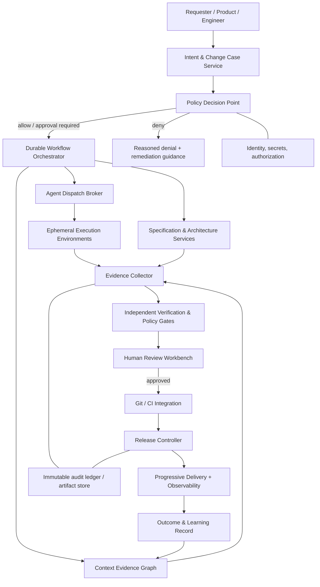

# AutoDev Studio (ADX)

## A governed, evidence-first operating system for agentic software delivery

**Document type:** Research-informed product and architecture blueprint  
**Source studied:** `AutoDev_Studio_Architecture_Specification.pdf` (v4.2.0-Enterprise, four pages)  
**Research cut-off:** 18 August 2026  
**Status:** Proposed target architecture; capabilities and vendor claims require validation in the buyer's own environment.

> **Thesis.** ADX should not compete by claiming to be an autonomous coder. It should compete by becoming the trusted control plane that converts ambiguous product intent into *reviewable, bounded, reversible, and evidenced* software changes—across whichever coding agents, repositories, CI systems, and deployment platforms an enterprise already uses.

---

## Executive decision

The source specification identifies a real market gap: most agentic-development products are optimized for producing code or pull requests, while regulated and high-consequence organizations need control over the entire chain from request to production. Its strongest ideas are (1) approval gates before irreversible actions, (2) isolated execution, (3) pluggable model/agent providers, (4) structured requirements and specifications, and (5) progressive delivery with rollback.

The document should be strengthened in five decisive ways:

1. **Replace “fully autonomous” and “zero breakages” with calibrated autonomy.** No model, test suite, or canary can prove absence of defects. ADX must make risk explicit, restrict authority by risk tier, and require independent evidence before promotion.
2. **Make the workflow event-sourced, not merely agent-orchestrated.** Every decision, tool call, artifact hash, approval, policy result, deployment, and rollback must be an immutable, attributable record.
3. **Use typed contracts as the product boundary.** Natural-language collaboration is useful inside an agent; critical handoffs between intent, design, code, evaluation, and deployment must be versioned schemas with provenance and validation.
4. **Separate the execution plane from the control plane.** Agents may be replaceable and fallible. The policy, identity, evidence, and release-authority layers must not depend on any one model or agent framework.
5. **Evaluate on the organization’s work, not vendor leaderboards.** A benchmark score is not production readiness. ADX needs a replayable evaluation corpus, task-specific quality thresholds, cost/latency measures, and safety failure tests.

The recommended initial product is **not** a general “AI software engineer.” It is a **governed change-delivery control plane** that coordinates existing coding agents for bounded changes and owns the artifacts, approvals, evaluation, and release gates. This is both more differentiated and more credible.

---

## 1. What the source document gets right—and what must change

### 1.1 Faithful synthesis of the source specification

The original ADX design proposes a six-stage lifecycle:

1. Capture a feature request; derive epics, stories, and Gherkin acceptance criteria.
2. Generate a technical specification and architecture/design proposal.
3. Route work to a selectable coding agent in an isolated micro-VM; produce tests and a pull request.
4. Deploy through development, testing, and production with canary verification.
5. Require human review at story, specification/design, pull-request, and production gates.
6. Implement with a Next.js interface; a Go/FastAPI control plane; LangGraph, PostgreSQL, Redis, Qdrant, tree-sitter, Firecracker, Git/CI APIs, Argo CD, Kubernetes, and model adapters.

This is directionally sound. It recognizes that an agent is an execution component, not an accountable engineering organization.

### 1.2 Non-negotiable corrections

| Source claim or design choice | Why it is insufficient | ADX replacement |
|---|---|---|
| “Fully autonomous” lifecycle | Autonomy without bounded authority magnifies prompt injection, supply-chain, secret, and blast-radius risk. | **Calibrated autonomy:** each action receives a policy decision: allow, require approval, require break-glass, or deny. |
| “Guarantee zero hallucinated production breakages” | This is not technically defensible. Testing observes a finite set of behaviors; production is an open environment. | **Safety case with residual risk:** require evidence, state what is untested, monitor post-release, and make rollback fast. |
| One canary health equation based on 5xx rate | A ratio may be unstable at low traffic, miss latency/business harm, and confuse correlation with causation. | **Multi-metric sequential analysis:** minimum sample sizes, guardrail SLOs, baseline comparison, error budget, and automated rollback rules. |
| DAG as the universal orchestration model | Many real workflows require loops, human pauses, compensation, retries, and long-lived state. | **Durable workflow state machine:** graph execution plus explicit idempotency, retries, timers, compensation, and state transitions. |
| RAG + AST described as “precise” understanding | Retrieval may be stale, incomplete, or semantically wrong; AST alone misses runtime and architectural dependencies. | **Evidence-aware context graph:** code, symbols, builds, tests, ownership, services, APIs, dependencies, and change history with freshness/version checks. |
| Human gates treated as generic clicks | Approval fatigue creates rubber-stamping. | **Risk-adaptive approvals:** reviewers see a concise change case, affected assets, policy deltas, evidence, and rollback plan; separation of duties is enforceable. |

### 1.3 Product definition

**ADX is a policy-governed change-management system for software agents.** It accepts a product-intent artifact, turns it into a traceable change package, dispatches constrained work to approved agent runtimes, independently evaluates the result, and controls promotion through CI/CD and progressive delivery.

Its unit of value is a **Change Case**, not a chat session.

```
Intent → Change Case → Approved design → Bounded agent run → Evidence bundle
      → Reviewed pull request → Release candidate → Progressive delivery → Outcome record
```

Each arrow is a typed, signed, versioned transition. An agent may propose a transition; only the control plane may authorize it.

---

## 2. Market research: 25 adjacent products and what ADX should learn

### 2.1 Method and important caveat

“Top 25” is used here as a **curated competitive set**, not as a claim of global revenue, market share, or benchmark rank. Products were selected for functional proximity to ADX across five layers: autonomous coding, IDE/terminal agents, cloud app builders, review/quality automation, and agent-orchestration frameworks. Capability descriptions are based primarily on vendor documentation linked in the references; availability, pricing, and feature boundaries change rapidly.

### 2.2 Comparative landscape

| # | Product | Primary surface | Closest capability | What ADX should adopt | Where ADX must differentiate |
|---:|---|---|---|---|---|
| 1 | [OpenAI Codex](https://openai.com/index/introducing-codex/) | Cloud, CLI, IDE | Parallel cloud software-engineering tasks in isolated environments; PR-ready work | Sandboxed task execution and evidence attached to work | Cross-vendor governance, pre-code intent/spec gates, release authority |
| 2 | [Claude Code](https://docs.anthropic.com/en/docs/claude-code/getting-started) | Terminal, IDE, CI | Repository-aware terminal agent | Durable project instructions and developer-native control | Independent policy/evidence plane rather than a single-agent harness |
| 3 | [GitHub Copilot](https://docs.github.com/en/copilot) | GitHub, IDE, CLI | Coding agents, custom agents, sandboxes, automations | Deep GitHub workflow integration and custom-agent ergonomics | Vendor-neutral Git/CI/deployment control, structured traceability beyond issues/PRs |
| 4 | [Cursor](https://docs.cursor.com/background-agent) | IDE, remote agent | Asynchronous agents editing and testing on isolated machines | Fast agent handoff, environment-as-code, accessible review | Mandatory risk policies before agents receive network/write credentials |
| 5 | [Windsurf](https://docs.windsurf.com/) | IDE | Agentic coding and codebase context | Low-friction interactive authoring loop | Enterprise change case, multi-service and production governance |
| 6 | [Devin](https://docs.devin.ai/get-started/devin-intro) | Cloud autonomous engineer | Long-running, parallel software tasks, test/browser work | Backlog-oriented task framing and asynchronous execution | Transparent state, typed artifacts, and human controls at *before-code* milestones |
| 7 | [Factory Droid](https://docs.factory.ai/welcome/index) | Terminal, IDE, CI, browser | Missions, custom subagents, policy-configurable automation | Specialized subagents, AGENTS.md, agent readiness, tool policy | Independent release evidence graph and formal approval/separation-of-duty model |
| 8 | [Replit Agent](https://docs.replit.com/learn/build-with-agent) | Browser/cloud IDE | Idea-to-app build, preview, publish | Product-intent intake and preview-first experience | Enterprise SDLC controls, portable environments, regulated delivery evidence |
| 9 | [Augment Code](https://docs.augmentcode.com/using-augment/agent) | IDE, terminal | Codebase context engine; plan/implement/test agent | Rich repository context and checkpoints | Context provenance/freshness and controls spanning deploy/change management |
| 10 | [JetBrains Junie](https://www.jetbrains.com/help/ai-assistant/junie-agent.html) | JetBrains IDE, CLI, CI | Multi-step agent, tests, tools, persistent instructions | IDE semantics, plan mode, `.aiignore`/instruction files | Cross-IDE and cross-platform control plane with auditable release gates |
| 11 | [Amazon Q Developer](https://docs.aws.amazon.com/amazonq/) | AWS, IDE, CLI | Build/operate AWS workloads | Cloud-aware operations context | Multi-cloud/on-prem release governance and agent-neutral evidence |
| 12 | [Gemini Code Assist](https://cloud.google.com/gemini/docs/codeassist/overview) | Google Cloud, IDE | Code assistance and cloud development | Service-aware cloud assistance | Provider-independent modeling, policy, and evaluation |
| 13 | [Sourcegraph Amp](https://sourcegraph.com/amp) | Terminal/IDE/web | Agentic codebase work and broad code search | Large-codebase navigation and code intelligence | Requirements-to-release traceability and controlled promotion |
| 14 | [Cline](https://docs.cline.bot/) | VS Code | Tool-using, model-flexible coding agent | Bring-your-own-model flexibility and transparent tool loop | Centralized enterprise policy, immutable records, deployment safety |
| 15 | [Aider](https://aider.chat/docs/) | Terminal | Git-aware pair programming with model choice | Minimal, reviewable git workflow | Multi-agent workflow, independent verification, and release orchestration |
| 16 | [Continue](https://docs.continue.dev/) | IDE, CLI | Open-source coding assistant with rules/context | Extensibility and local/private model posture | Durable workflow and high-assurance change controls |
| 17 | [OpenHands](https://docs.all-hands.dev/) | Local/cloud agent runtime | Open software-development agents with tool execution | Interchangeable open agent runtime | Governed dispatch, artifact contracts, release decisioning |
| 18 | [SWE-agent](https://swe-agent.com/latest/) | CLI/research runtime | Issue-to-patch autonomous agent | Reproducible issue-resolution harness | Product/designer/ops stages and enterprise workflow controls |
| 19 | [Qodo](https://docs.qodo.ai/) | PR/IDE/CLI | AI code review, test and quality workflows | Review guidance and PR-native quality signals | Connect review findings to architecture approval, deploy guardrails, and outcomes |
| 20 | [CodeRabbit](https://docs.coderabbit.ai/) | Pull request review | Automated contextual PR review | Fast reviewer feedback and repository rules | Independent end-to-end evidence from requirement through live metrics |
| 21 | [SonarQube](https://docs.sonarsource.com/sonarqube/) | CI/quality platform | Static analysis and quality gates | Mature deterministic quality gates | Treat deterministic analysis as one verifier among tests, policy, and runtime evidence |
| 22 | [Snyk](https://docs.snyk.io/) | DevSecOps | Dependency, code, container, and IaC security checks | Security policy and remediation signals | Make security results promotion prerequisites with explicit exceptions and expiry |
| 23 | [LangGraph](https://langchain-ai.github.io/langgraph/) | Agent framework | Stateful, controllable agent workflows | Durable stateful graph ideas and explicit routing patterns | Do not expose framework internals as product contracts; ADX owns portable workflow semantics |
| 24 | [Microsoft AutoGen](https://microsoft.github.io/autogen/stable/) | Agent framework | Event-driven multi-agent teams and distributed runtimes | Role specialization, termination, observability | Typed change contracts and centralized policy instead of informal agent chat as truth |
| 25 | [CrewAI](https://docs.crewai.com/) | Agent framework | Crews, flows, tool-using role workflows | Simple composition of specialist roles | Deterministic controls, evidence retention, and separation of duties at enterprise scale |

### 2.3 The strategic finding

The field is converging on four commodity capabilities: codebase context, agent tool use, multi-file edits, and an asynchronous/cloud execution option. The sources themselves illustrate that convergence: Cursor documents isolated remote agents with repository write access; Codex describes isolated task environments and test iteration; GitHub documents cloud/local sandboxes and automations; Factory documents custom, policy-scoped subagents; and Replit covers plan, build, test, and publish flows. [Cursor](https://docs.cursor.com/background-agent), [Codex](https://openai.com/index/introducing-codex/), [GitHub Copilot](https://docs.github.com/en/copilot), [Factory](https://docs.factory.ai/harness/subagents), [Replit](https://docs.replit.com/build/your-first-app)

Therefore, ADX should not attempt to win by reimplementing every agent interface. Its defensible layer is the **governed transition system** around agents:

- portable Change Case schemas;
- policy-as-code for authority and data access;
- evidence collection that is independent of the agent’s own self-report;
- risk-based human review and separation of duties;
- reproducible execution environments;
- multi-signal release decisions and fast, practiced rollback;
- end-to-end traceability from business objective to post-release outcome.

---

## 3. The ADX operating model

### 3.1 The Change Case

A Change Case is an immutable logical record with mutable *states*, never mutable historical evidence. It contains:

- **Intent:** business outcome, actor, scope, constraints, linked issue/request, data classification, risk tier.
- **Specification:** user stories, non-functional requirements, acceptance tests, architecture decision records (ADRs), design-token changes, APIs, schema migrations, and threat model.
- **Execution mandate:** authorized repository/ref, permitted tools, network/data policy, environment digest, model/agent identity, budget, timeout, and stop conditions.
- **Evidence bundle:** source/lockfile digests, tool-call receipts, logs, test results, static/dynamic/security scans, screenshots, diffs, SBOM/provenance, evaluator decisions, and reviewer attestations.
- **Release plan:** target environment, owner, progressive-delivery strategy, SLO guardrails, rollback action, communication plan, and expiration date for exceptions.
- **Outcome:** production observations, rollout decision history, incidents, rollback status, post-implementation review, and feedback labels for evaluation.

### 3.2 Risk tiers drive authority

| Tier | Typical change | Agent may | Human requirement | Release policy |
|---|---|---|---|---|
| R0 | Docs, tests, formatting, generated clients | Read/write in sandbox; open draft PR | Optional code-owner review | No production deployment |
| R1 | Isolated feature with no sensitive data or infra | Execute approved test commands; open PR | Code-owner approval | Preview only; standard CI gates |
| R2 | Cross-service feature, dependency update, user-facing behavior | Modify bounded repos; run tests; propose migration | Design + code-owner approval | Staging plus guarded canary |
| R3 | Auth, payments, PII, external writes, production IaC, data migration | Read and propose only until explicit scoped authorization | Security + architecture + service owner approvals | Change window, staged rollout, on-call acknowledgement |
| R4 | Regulated/high-impact systems or irreversibility | Analyze and generate evidence only | Formal change authority; independent reviewer | Manual release; enhanced monitoring; no autonomous execution |

Risk is calculated from asset criticality, blast radius, data classification, change type, authorization boundary, dependency novelty, test coverage, and historical incident signals. A low-complexity change to a high-impact asset is still high risk.

### 3.3 Roles are capabilities, not personalities

Agents should not “chat until done.” Each worker receives a narrow role, minimal tool set, input schema, output schema, and a maximum authority level.

| Role | Inputs | Allowed outputs | Must not do |
|---|---|---|---|
| Product analyst | Intent, product constraints | Story graph, ambiguity register, BDD tests | Approve scope or select architecture |
| Architect | Approved story graph, system inventory | ADRs, interface/migration plan, risk assessment | Write/merge production code |
| Planner | Approved design, repository map | Ordered execution plan and tool budget | Change files |
| Implementer | Approved plan, scoped repository/worktree | Patch, tests, run log | Merge/deploy or alter policy |
| Independent verifier | Patch, acceptance suite, isolated environment | Reproducible test and policy evidence | Edit the candidate patch |
| Security verifier | Diff, SBOM, threat model, scan policy | Security findings and disposition requirement | Waive its own critical finding |
| Release controller | Approved evidence and rollout policy | Release decision, progressive action, rollback | Author source code or override immutable policy |

The same model provider may power multiple roles, but independence is stronger when verifier prompts, contexts, tool permissions, and—where risk warrants—models or organizations are separated.

### 3.4 Agent interoperability: bring the best agent, retain ADX control

ADX is an agent-neutral control plane, not a replacement for every coding agent. It can connect providers such as Codex, Claude Code, GitHub Copilot, Cursor, Devin, Factory Droid, local/open-weight models, and internal agent runtimes through a versioned adapter contract. The adapter translates an ADX execution mandate into provider-specific operations and returns normalized progress, artifacts, costs, errors, and tool receipts.

This is intentionally not a promise that every agent receives the same authority. ADX assigns each integration to the highest safe tier its adapter can prove:

| Tier | Suitable use | Minimum proof |
|---|---|---|
| Advisory | Research, planning, review, explanation | Identity and read-only context policy |
| Supervised implementation | Bounded code changes and draft PRs | Start/stream/cancel, artifact collection, capability declaration, sandbox lease enforcement |
| Governed execution | Policy-scoped repository and CI actions | Tool receipts, stable version identity, idempotency, cost reporting, external-state reconciliation |
| High-assurance execution | Work authorized for higher risk tiers | Independently verifiable environment/artifact provenance plus tested cancellation, recovery, and security controls |

No agent—regardless of brand or benchmark—may bypass ADX policy, execution leases, tool gateways, evidence collection, approval gates, or the release controller. An agent that cannot offer the required observability or control remains useful, but only as an advisory or tightly supervised integration.

---

## 4. Target architecture

### 4.1 A control-plane-first design



### 4.2 Planes and trust boundaries

| Plane | Responsibility | Trust requirement |
|---|---|---|
| Experience plane | Intake, review workbench, notifications, dashboards | Never directly grants deployment authority |
| Control plane | Workflow state, policy evaluation, approvals, budgets, scheduling | Highly available, event-sourced, least-privilege service identities |
| Context plane | Indexed code/symbols/docs/ownership/dependencies/runbooks | Source provenance, freshness timestamps, ACL-aware retrieval |
| Execution plane | Agent environments, browser/test tools, worktrees | Ephemeral, network egress controlled, no ambient cloud credentials |
| Verification plane | Independent test, scan, policy, and evaluator jobs | Cannot modify the candidate under evaluation; results signed/hashed |
| Delivery plane | CI/CD, feature flags, Argo Rollouts/other deploy systems, telemetry | Deployment credentials scoped to controller; no agent direct production access |
| Audit plane | Append-only event and artifact ledger | Tamper-evident retention, access-controlled, exportable |

### 4.3 Recommended implementation choices

The source’s technology choices are usable, but should be framed as replaceable implementations:

- **Workflow:** Temporal, durable execution primitives, or a carefully designed stateful graph runtime. LangGraph is useful for agent subflows, but must not be the sole system of record. LangGraph itself distinguishes deterministic custom workflows from agentic behavior and warns that multi-agent is not always necessary. [LangGraph multi-agent patterns](https://langchain-ai.github.io/langgraph/tutorials/multi_agent/multi-agent-collaboration/)
- **State:** PostgreSQL for relational change state plus an append-only event store/outbox. Redis is cache/notification infrastructure, never the durable source of truth.
- **Context:** symbol/code graph plus retrieval index. Version every index entry with repository commit, parser version, embedding model, ACL, and capture time. Do not let retrieval answer substitute for a source citation.
- **Sandbox:** Firecracker microVM or hardened container runtime with read-only base image, per-run worktree, short-lived credentials, egress allowlist/proxy, resource quotas, and deletion attestations.
- **Secrets:** workload identity and brokered, time-bound secrets. Redact logs, scan artifacts, and forbid secrets from prompt/context by default.
- **Policy:** Open Policy Agent/Cedar-style declarative policy, evaluated at every side effect: context access, tool use, git write, secret request, CI trigger, environment promotion, and rollback.
- **Observability:** OpenTelemetry traces correlated by `change_case_id`, `run_id`, `artifact_digest`, and deployment revision.

---

## 5. Formal lifecycle and gates

### Gate 0 — Intake and classification

**Goal:** establish a trustworthy request boundary before an agent sees privileged context.

Required checks: requester identity; repo/service ownership; data classification; risk tier; duplicate/conflicting work; prohibited scope; success metric; affected environments; and whether the request requires a human product decision.

Output: `IntentRecord@v1` and an ambiguity register. The system must ask questions or stop when acceptance criteria, ownership, or authority is unknown.

### Gate A — Product and story approval

**Goal:** approve *what* will be changed.

The analyst proposes stories, exclusions, examples, BDD acceptance scenarios, non-functional requirements, and assumptions. A reviewer approves the semantic contract, not prose alone. Every acceptance criterion must map to at least one proposed validation method; untestable requirements remain explicit risks.

### Gate B — Architecture, security, and change-design approval

**Goal:** approve *how* the change will be made before source files are changed.

Required artifacts for R2+ include: ADR, interface/schema delta, dependency/license impact, data migration and backfill plan, threat model delta, test strategy, rollout/rollback strategy, owners, and cost/performance constraints. Design review should reject designs that lack a safe migration or an observable success condition.

### Gate C — Execution authorization

**Goal:** convert the approved plan into a bounded machine mandate.

The policy engine issues a signed execution lease containing allowed repositories/ref, tools, network destinations, data sources, max cost/tokens/time, write boundaries, and stop conditions. The agent receives no authority beyond the lease. Every tool call is checked against it.

### Gate D — Independent evidence and pull-request approval

**Goal:** verify that the candidate meets the approved contract.

The verifier runs in a fresh environment from pinned inputs. It checks build reproducibility, targeted acceptance tests, regression tests, static analysis, dependency/SBOM and vulnerability rules, secret scan, infrastructure policy, and visual/API compatibility as applicable. A human reviews the diff alongside a compact Change Case: assumptions, policy exceptions, evidence failures, and residual risk. A green agent self-report is not evidence.

### Gate E — Release authorization and progressive delivery

**Goal:** determine whether *this exact artifact* may be released.

Promotion requires artifact provenance linking source commit → build → test evidence → signed release candidate. The release controller verifies environment policy and creates a release action. Agents never receive broad production credentials.

### Gate F — Outcome and learning closure

**Goal:** make production feedback operational.

The system records rollout result, guardrail metrics, alerts, manual interventions, rollback, incident link, and post-release assessment. Labels feed an offline evaluation set only after privacy/retention checks.

---

## 6. Evidence model and core contracts

### 6.1 Contract principles

1. Schemas are versioned, backward-compatible where possible, and validated at every boundary.
2. Every record carries `id`, `schemaVersion`, `createdAt`, `createdBy`, `sourceDigest`, and `provenance`.
3. Large artifacts live in immutable object storage; contracts hold cryptographic digests and URIs, not unbounded logs.
4. Approvals are signed attestations over a precise artifact set, not a generic “approve” button.
5. Policy exceptions require an owner, rationale, compensating controls, expiry, and review date.

### 6.2 Illustrative Change Case schema

```json
{
  "$schema": "https://json-schema.org/draft/2020-12/schema",
  "$id": "https://adx.example/schemas/change-case/v1.json",
  "title": "ADXChangeCase",
  "type": "object",
  "required": ["id", "schemaVersion", "intent", "risk", "state", "provenance"],
  "properties": {
    "id": { "type": "string", "format": "uuid" },
    "schemaVersion": { "const": "v1" },
    "state": {
      "enum": ["draft", "awaiting_story_approval", "awaiting_design_approval",
        "authorized", "executing", "verifying", "awaiting_merge", "releasing",
        "observing", "completed", "rolled_back", "rejected", "cancelled"]
    },
    "intent": {
      "type": "object",
      "required": ["summary", "requester", "repositories", "acceptanceCriteria"],
      "properties": {
        "summary": { "type": "string", "minLength": 1, "maxLength": 4000 },
        "requester": { "$ref": "#/$defs/principal" },
        "repositories": { "type": "array", "items": { "$ref": "#/$defs/repositoryRef" } },
        "acceptanceCriteria": { "type": "array", "minItems": 1, "items": { "type": "string" } },
        "outOfScope": { "type": "array", "items": { "type": "string" } }
      }
    },
    "risk": {
      "type": "object",
      "required": ["tier", "factors", "assessedAt"],
      "properties": {
        "tier": { "enum": ["R0", "R1", "R2", "R3", "R4"] },
        "factors": { "type": "array", "items": { "type": "string" } },
        "assessedAt": { "type": "string", "format": "date-time" }
      }
    },
    "provenance": { "$ref": "#/$defs/provenance" }
  },
  "$defs": {
    "principal": { "type": "object", "required": ["subject", "issuer"], "properties": { "subject": { "type": "string" }, "issuer": { "type": "string" } } },
    "repositoryRef": { "type": "object", "required": ["url", "commit"], "properties": { "url": { "type": "string", "format": "uri" }, "commit": { "type": "string" } } },
    "provenance": { "type": "object", "required": ["createdAt", "createdBy"], "properties": { "createdAt": { "type": "string", "format": "date-time" }, "createdBy": { "$ref": "#/$defs/principal" }, "artifactDigests": { "type": "array", "items": { "type": "string" } } } }
  }
}
```

### 6.3 Approval attestation

An approval must bind to the exact review surface:

```text
approval_id, change_case_id, gate, decision, reviewer_identity,
reviewed_artifact_digests[], policy_version, rationale, timestamp, signature
```

If a story, design, patch, policy, or evidence digest changes after approval, ADX invalidates dependent approvals automatically.

---

## 7. Secure agent execution

### 7.1 Threats ADX must design for

- Prompt injection in repository text, tickets, documentation, test fixtures, web pages, or tool output.
- Data exfiltration through network tools, package installation, logs, commits, or pull requests.
- Secret disclosure through ambient credentials or overbroad context retrieval.
- Supply-chain compromise through dependencies, actions, images, and generated build scripts.
- Unsafe or destructive tool invocation.
- Confused deputy: an agent using the control plane’s authority for a request it should not satisfy.
- Evidence forgery/self-verification: an agent changes tests, suppresses a check, or selectively reports logs.
- Runaway cost, concurrency, or retry loops.

Cursor’s own background-agent documentation explicitly notes that unattended terminal execution plus internet access introduces prompt-injection and exfiltration risk. That is a useful design signal for ADX: permissions, egress, and approval must be product primitives—not documentation footnotes. [Cursor security notes](https://docs.cursor.com/background-agent)

### 7.2 Required controls

| Control | Minimum design |
|---|---|
| Identity | Separate human, agent, verifier, controller, and service identities; workload identity over long-lived keys. |
| Authority | Short-lived, task-scoped execution lease; per-tool authorization; deny-by-default network and secrets. |
| Isolation | Disposable VM/worktree; immutable base image; CPU/memory/disk/process quotas; no shared Docker socket. |
| Network | Egress proxy/allowlist; DNS logging; block metadata services and arbitrary uploads; explicit internet mode. |
| Context | ACL-filtered retrieval; untrusted-content labels; quote/source boundaries; no automatic execution of retrieved instructions. |
| Secrets | Just-in-time brokered secrets; redaction; no secret persistence in prompts/logs; rotate on suspected exposure. |
| Supply chain | Pinned dependencies, lockfile policy, SBOM, provenance attestations, signed artifacts, license/vulnerability checks. |
| Side effects | Dry-run/plan first for infrastructure and migrations; two-person/break-glass policy for irreversible actions. |
| Audit | Append-only tool receipts and artifact digests; tamper-evident storage; export for incident review. |
| Kill switch | Cancel run, revoke lease, isolate environment, invalidate credentials, stop rollout, and roll back. |

### 7.3 Human-in-the-loop that actually improves safety

HITL is valuable only when it is informed and proportional. The reviewer workbench should show:

- a plain-language summary of intended behavior and non-goals;
- exact changed files, dependency/IaC/schema deltas, and ownership;
- pass/fail evidence with links to reproducible logs—not a model summary alone;
- unresolved assumptions and negative test coverage;
- a risk explanation and policy exceptions with expiry;
- rollout and rollback plan; and
- the impact of approving *this exact digest set*.

Do not require four manual approvals for a typo. Do require independent authorization where agent actions cross trust boundaries.

---

## 8. Verification and release engineering

### 8.1 The verification pyramid becomes an evidence lattice

ADX should require the relevant subset of the following, based on risk—not blindly run every check:

1. deterministic formatting/type/build checks;
2. unit and property-based tests;
3. contract/API compatibility checks;
4. integration tests against controlled dependencies;
5. end-to-end/browser tests and visual regression where UI changes;
6. performance/load and resilience tests where SLOs may change;
7. SAST, dependency, secret, IaC, container, and license controls;
8. adversarial tests for authorization, data isolation, and prompt-injection surfaces;
9. independent LLM evaluation for semantic requirements, with rubric, fixtures, and error analysis;
10. production guardrails and post-release observation.

Each result needs: tool/version, command or configuration digest, environment digest, inputs, timestamps, exit status, raw artifact pointer, and interpretation policy.

### 8.2 Correcting the canary model

The source formula compares canary and baseline 5xx rates. Keep error rate as one signal, but replace the single score with an explicit decision policy:

```text
PROMOTE only if, for a minimum observation window and sample size:
  - availability/error-rate guardrail remains within absolute and relative bounds;
  - p95/p99 latency guardrails remain within bounds;
  - saturation and dependency-error guardrails remain within bounds;
  - domain outcome metric does not regress beyond its tolerated interval;
  - no security, data-integrity, or synthetic-check stop condition fires.

PAUSE when evidence is insufficient or noisy.
ROLL BACK when any hard guardrail fires, or when a predeclared sequential test crosses
its regression boundary.
```

Illustrative policy (values are service-specific, not defaults):

```yaml
analysis:
  minimum_observation: 15m
  minimum_requests: 5000
  hard_stop:
    - metric: http_5xx_rate
      condition: canary > 1.0% and canary > 1.5 * baseline
    - metric: p95_latency_ms
      condition: canary > 1.2 * baseline and canary > 350
    - metric: payment_success_rate
      condition: canary < baseline - 0.5 percentage_points
  steps: [5%, 15%, 30%, 60%, 100%]
  on_insufficient_data: pause
  on_hard_stop: rollback
```

Progressive-delivery controllers such as [Argo Rollouts](https://argo-rollouts.readthedocs.io/) are appropriate execution mechanisms, but ADX must own the approved analysis policy, evidence link, and decision record.

### 8.3 Database and stateful changes

Stateful changes need a separate track; a canary does not undo a destructive migration. Require expand/contract migrations, backward/forward compatibility, backup/restore validation, backfill idempotency, data-quality checks, and a rollback/roll-forward decision before production. R3/R4 migrations should be designed and approved before any implementation agent executes.

---

## 9. Evaluation science: prove value before scale

### 9.1 Why vendor benchmarks are insufficient

Agent frameworks themselves caution that multi-agent systems add scaffolding and should be used when a single agent is inadequate. [AutoGen Teams](https://microsoft.github.io/autogen/stable/user-guide/agentchat-user-guide/tutorial/teams.html) ADX should make “use multiple agents” a measured architectural choice, not an ideological default.

Public coding benchmarks are useful regression signals, but they do not represent an organization’s architecture, quality gates, incident history, security posture, or deployment constraints. A strong ADX evaluation program uses three corpora:

- **Historical replay:** sanitized, closed historical tickets/PRs with known accepted outcomes.
- **Prospective shadow mode:** ADX proposes plans/patches/evidence without merge/deploy authority; humans compare outcomes.
- **Adversarial safety suite:** planted prompt injections, misleading docs, forbidden egress, flaky tests, conflicting requirements, secret-like values, and destructive command traps.

### 9.2 Success metrics

| Dimension | Metric | Target-setting principle |
|---|---|---|
| Outcome quality | Acceptance-criteria pass rate; human accepted PR rate; escaped-defect rate | Compare to baseline by task class and confidence interval |
| Engineering flow | Lead time, review time, rework rate, PR cycle time | Never optimize speed at the expense of incident rate |
| Safety | Policy violation attempts blocked; secret/egress incidents; unsafe action rate | Target near-zero realized violations, with tested detection coverage |
| Reliability | Build/test reproducibility; workflow failure/retry rate; rollback time | Measure by environment and risk tier |
| Economics | Cost per accepted change; tokens/tools/compute per outcome | Attribute all execution, verification, and human-review costs |
| Trust | Reviewer override rate; approval reversal; explanation usefulness | High rubber-stamp rate is a warning, not success |
| Learning | Improvement on held-out replay set without safety regression | Freeze evaluation sets and track versioned results |

### 9.3 Experiment protocol

For each candidate agent/model/configuration: freeze task set; fix environment; record prompts/policies/tool versions; run multiple trials where nondeterminism matters; compare against a human/current-tool baseline; classify failures; and promote only if outcome quality, safety, cost, and latency meet the tier’s thresholds. Do not deploy model changes solely because an aggregate benchmark rises.

---

## 10. Delivery roadmap

### Phase 0 — Safety and evidence foundations (4–6 weeks)

Deliver: Change Case state model; identity/RBAC; policy decision point; immutable event/artifact model; GitHub/GitLab read-only integration; one ephemeral sandbox; review workbench; trace correlation.

Exit criteria: every agent action is attributable; no agent has production credentials; a reviewer can reconstruct a completed sandbox run from immutable artifacts.

### Phase 1 — Bounded code changes (6–8 weeks)

Deliver: intent-to-story flow; one agent adapter; plan → implementation → independent verification workflow; draft PR creation; test/SAST/SBOM receipts; R0/R1 policy packs.

Exit criteria: shadow-mode acceptance rate and safety performance established on at least 50 representative historical tasks; all PR evidence is reproducible from pinned inputs.

### Phase 2 — Design and risk controls (6–8 weeks)

Deliver: ADR/threat-model/schema-delta artifacts; R2 approvals; context evidence graph; dependency/IaC policy; ownership integration; exception workflow.

Exit criteria: reviewers can identify source provenance for every material architectural claim; exceptions expire automatically.

### Phase 3 — Controlled release (8–12 weeks)

Deliver: build provenance; staging deployment integration; feature-flag/canary controller integration; SLO guardrail policies; rollback controller; outcome record.

Exit criteria: successful game-day rollback; release controller rejects mismatched provenance; deployment authority remains outside agent credentials.

### Phase 4 — Scale and multi-agent specialization (ongoing)

Deliver: more agent adapters; selective specialist roles; multi-repository Change Cases; portfolio dashboards; offline evaluator; regulated-policy packs.

Exit criteria: each additional agent role demonstrates measurable value over a single-agent workflow without added safety or cost regression.

---

## 11. Open decisions that must be made deliberately

1. **System of record:** Is ADX authoritative for change state, or an overlay on Jira/GitHub/ServiceNow? Recommendation: ADX is authoritative for agent-run/evidence/release state; synchronize external work systems.
2. **Model strategy:** Which providers and local models are permitted per data class? Define a model registry with approval status, regions, retention terms, and evaluation results.
3. **Data boundary:** May any source code leave the customer VPC? Support a private execution mode from day one for high-value repositories.
4. **Evidence retention:** Define retention, legal hold, deletion, access review, and export policies before collecting agent transcripts and code artifacts.
5. **Approval authority:** Map R2–R4 approvals to real service owners, security roles, and change-management processes; do not invent a parallel bureaucracy.
6. **Scope of deployment:** Begin with preview/staging and one well-instrumented production service; avoid claiming general production autonomy before game days and measured success.

---

## 12. Reference architecture acceptance criteria

ADX is ready for a bounded production pilot only when all of the following are demonstrably true:

- A request cannot reach code execution without a valid, policy-authorized Change Case.
- Agent tool calls are lease-checked and fully logged; unauthorized egress, secrets, and side effects are blocked.
- The verifier can reproduce the candidate from pinned repository, environment, and dependency inputs without trusting the implementer’s summary.
- A reviewer’s approval is tied to immutable artifact digests and invalidates on material change.
- A release cannot deploy an artifact without provenance and the required approvals/evidence.
- A canary pause/rollback can be exercised end-to-end in a game day, including credential revocation and stakeholder notification.
- Every completed pilot task has an outcome record, including failures, overrides, and residual risks.
- The pilot improves an agreed business/engineering outcome versus baseline without worsening a safety metric.

---

## References

### Primary product documentation

1. OpenAI. [Introducing Codex](https://openai.com/index/introducing-codex/). Cloud task execution, sandboxes, parallel work, test iteration, and PR workflow.
2. Anthropic. [Claude Code: Getting started](https://docs.anthropic.com/en/docs/claude-code/getting-started). Terminal agent setup and enterprise deployment paths.
3. GitHub. [GitHub Copilot documentation](https://docs.github.com/en/copilot). Coding agents, sandboxes, custom agents, and automations.
4. Cursor. [Background Agents](https://docs.cursor.com/background-agent). Remote execution, repository integration, environment configuration, and security cautions.
5. Cognition. [Introducing Devin](https://docs.devin.ai/get-started/devin-intro). Autonomous software-engineering task categories.
6. Factory. [Platform documentation](https://docs.factory.ai/welcome/index) and [Custom droids](https://docs.factory.ai/harness/subagents). Agent-native development, missions, tool policy, and specialized subagents.
7. Replit. [Build with Agent](https://docs.replit.com/learn/build-with-agent) and [Build and publish an app](https://docs.replit.com/build/your-first-app). Plan/build/test/publish workflow.
8. Augment. [Using Agent](https://docs.augmentcode.com/using-augment/agent). Context engine, planning, checkpoints, tools, and MCP.
9. JetBrains. [Junie](https://www.jetbrains.com/help/ai-assistant/junie-agent.html) and [Junie CLI](https://junie.jetbrains.com/docs/). Multi-step agent, instructions, tool use, and CI modes.
10. AWS. [Amazon Q documentation](https://docs.aws.amazon.com/amazonq/). AWS development and operations assistant.
11. Google Cloud. [Gemini Code Assist overview](https://cloud.google.com/gemini/docs/codeassist/overview). Google Cloud coding assistance.
12. Sourcegraph. [Amp](https://sourcegraph.com/amp). Agentic coding product information.
13. Cline. [Documentation](https://docs.cline.bot/). Open coding-agent interface and configuration.
14. Aider. [Documentation](https://aider.chat/docs/). Git-aware terminal pair programming.
15. Continue. [Documentation](https://docs.continue.dev/). Open-source assistant, context, and configuration.
16. All Hands AI. [OpenHands documentation](https://docs.all-hands.dev/). Open software-development agent runtime.
17. SWE-agent. [Documentation](https://swe-agent.com/latest/). Issue-to-patch software-agent workflow.
18. Qodo. [Documentation](https://docs.qodo.ai/). AI-assisted quality and review workflows.
19. CodeRabbit. [Documentation](https://docs.coderabbit.ai/). Automated PR review.
20. Sonar. [SonarQube documentation](https://docs.sonarsource.com/sonarqube/). Quality and static-analysis gates.
21. Snyk. [Documentation](https://docs.snyk.io/). Application-security scanning and policy.

### Architecture, workflow, delivery, and security references

22. LangChain. [LangGraph multi-agent patterns](https://langchain-ai.github.io/langgraph/tutorials/multi_agent/multi-agent-collaboration/). Patterns and trade-offs for multi-agent coordination.
23. Microsoft. [AutoGen](https://microsoft.github.io/autogen/stable/) and [Teams guidance](https://microsoft.github.io/autogen/stable/user-guide/agentchat-user-guide/tutorial/teams.html). Event-driven agents, teams, observability, and guidance to start with a single agent where possible.
24. CrewAI. [Documentation](https://docs.crewai.com/). Crew and flow composition patterns.
25. Argo Project. [Argo Rollouts documentation](https://argo-rollouts.readthedocs.io/). Progressive delivery mechanisms.
26. NIST. [AI Risk Management Framework](https://www.nist.gov/itl/ai-risk-management-framework). Governance, measurement, management, and documentation framing for AI risk.
27. NIST. [Secure Software Development Framework (SSDF)](https://csrc.nist.gov/projects/ssdf). Secure software-development practices.
28. SLSA. [Supply-chain Levels for Software Artifacts](https://slsa.dev/). Build provenance and software supply-chain assurance.
29. OWASP. [Top 10 for LLM Applications](https://genai.owasp.org/llm-top-10/). Prompt injection, sensitive-information disclosure, and agent/tool risks.
30. OpenTelemetry. [Documentation](https://opentelemetry.io/docs/). Vendor-neutral tracing, metrics, and logs.

---

## Closing statement

The extraordinary opportunity is not to eliminate engineers from software delivery. It is to give engineers a system in which agents can move quickly **without making trust optional**. ADX wins when a product leader can state an intent, an agent can make bounded progress, a reviewer can understand and verify the consequence, and an operator can release—or reverse—the exact artifact with confidence.
