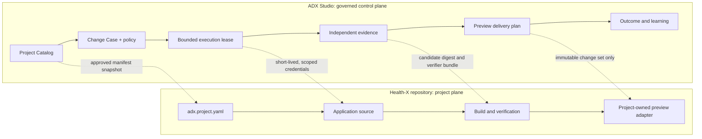
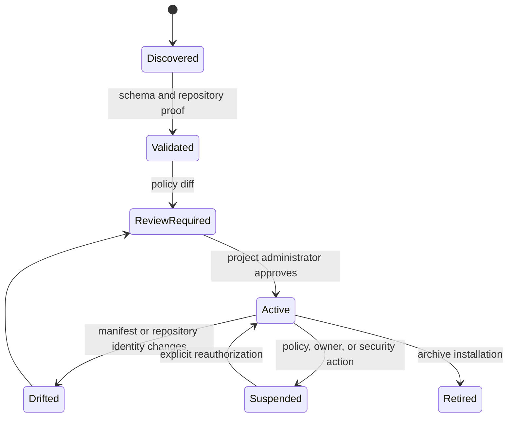

# ADX Multi-Project Platform Design

## Status and Decision

**Status: proposed architecture; not implemented.** This document records a recommended target architecture. It does not create a project catalog, a project manifest format, external Health-X repository, project-owned adapter, production deployment, or secret broker.

**Recommendation:** evolve ADX Studio into a repository-agnostic governed delivery control plane, then move Health-X into its own repository and connect it to ADX as the first external project installation.

In the target design, ADX owns authorization, policy, leases, evidence bindings, audit history, and delivery-plan provenance. Each project repository owns its source, build instructions, dependency credentials, runtime configuration, and product documentation. The target removes project-specific paths, Dockerfiles, npm credentials, and framework assumptions from the ADX server.

This is not a microservice split for its own sake. It is a trust boundary: an ADX workspace should safely govern many independently evolving projects without gaining arbitrary write access or becoming a catalog of special cases.

## Research Signals

The target combines the strongest applicable ideas from ten leading platforms reviewed on 2026-08-26.

| Platform | Signal adopted by ADX |
| --- | --- |
| [Linear](https://linear.app/) | One work item connects intake, planning, agents, diff review, and operating metrics; agents work within a visible lifecycle. |
| [GitHub Copilot](https://github.com/features/copilot) | Repository-scoped context, selectable agents/models, centralized governance, allow-listed integrations, and auditability. |
| [GitLab](https://about.gitlab.com/) | A common data plane across planning, source, CI, security, release, and compliance while teams retain control of their workflows. |
| [CircleCI](https://circleci.com/) | “Validate everything” through portable execution environments and explicit confidence before promotion. |
| [Vercel](https://vercel.com/) | Isolated sandboxes, durable orchestration, an AI gateway, and environments as first-class platform primitives. |
| [Netlify](https://www.netlify.com/) | A project is the stable unit regardless of entry point; every change earns a private preview before promotion. |
| [Figma](https://www.figma.com/) | Shared context for people and agents with deliberate human review rather than opaque automation. |
| [Snyk](https://snyk.io/) | Inventory agents and AI workloads; secure code, agents, and application behavior independently. |
| [PagerDuty](https://www.pagerduty.com/) | Closed-loop operations: detect, respond, learn, and feed outcomes back into future work. |
| [Backstage](https://backstage.io/) | A software catalog, declared ownership, reusable golden paths, and documentation/metadata that lives with the project. |

The recommended combination is a **Delivery Passport**: a versioned, reviewed manifest that a project would present to ADX. In the target system, ADX would turn an approved passport snapshot into a constrained, evidence-producing execution installation. This format and lifecycle do not exist in the current codebase.

## Current Boundary Problem

Health-X is currently an application nested in `apps/health-x`. Its preview profile in ADX hard-codes its path, Dockerfile, internal registry, npm secret requirement, port, and readiness route. The candidate export flow also starts from an ADX monorepo checkout. This creates three unwanted couplings:

1. An unrelated ADX working-tree change can block Health-X delivery.
2. Adding a second product encourages another application-specific preview profile and path exception.
3. A project’s build credential and runtime assumptions become control-plane implementation details.

The candidate exporter accepts `projectPath` and scopes Git status checks and tree comparisons. `preview-delivery-service.mjs` forwards the registered repository `projectPath`, and the preview-plan digest binds that scope; focused regressions prove unrelated ADX changes neither block nor leak into a Health-X export while in-scope changes fail closed. Once Health-X is external, the project repository itself becomes the primary scope boundary.

## Target Model

Everything in this section is proposed behavior, not a description of the current implementation.



### Ownership

| Concern | Owner | Rule |
| --- | --- | --- |
| Tenant, roles, Change Case workflow, approvals, policy | ADX | The project cannot bypass or redefine authority. |
| Project identity, source repository, subdirectory, build/test/preview contract | Project manifest | ADX imports and approves a snapshot; browsers do not supply it. |
| Agent/model gateway configuration and execution limits | ADX policy + project capability request | The effective permission is the intersection, never the union. |
| Dependency credentials, deployment secrets, runtime variables | Project-owned secret provider | Secret values never enter a manifest, evidence record, candidate tree, plan, or ADX database. |
| Candidate checkout or sandbox | Ephemeral ADX execution substrate | Created from the registered repository/ref and destroyed after retention policy permits. |
| Verification evidence and delivery preview | ADX | Always binds the candidate digest, manifest digest, policy version, and verifier identity. |
| Deployment behavior | Project-owned adapter with ADX authorization | Preview-only remains the default; promotion requires a separate, explicit release capability. |

## Delivery Passport

`adx.project.yaml` is a proposed declarative contract committed with a project. It is metadata, not executable code. The target implementation would validate a schema, resolve it against organization policy, and store an immutable approved snapshot. ADX does not currently parse or store this file.

The following is illustrative only. It is not a current Health-X file, and it must not be copied verbatim as a working configuration. In particular, Health-X currently declares only `dev` and `build` scripts; its acceptance verification is invoked by the ADX root script `npm run verify:health-x`.

```yaml
apiVersion: adx.io/v1alpha1
kind: DeliveryPassport
metadata:
  id: health-x
  displayName: Health-X
  owner: personal-care-demo
  classification: fictional-demo
repository:
  canonicalRemote: https://github.example/organization/project.git
  defaultBaseRef: refs/heads/main
  sourcePath: .
build:
  runtime: node-22
  install: npm ci
  validateTemplate: node-web-production-build
preview:
  adapter: container
  dockerfile: Dockerfile
  context: .
  readiness:
    port: 3000
    path: /
  secretRefs:
    - npm-registry-read
capabilities:
  agent:
    writePaths:
      - src/**
      - tests/**
    network: package-registry-only
  delivery:
    preview: true
    production: false
```

### Proposed Manifest Rules

1. `id`, canonical remote, and default ref are immutable for an installation. Moving a repository creates a deliberate re-registration event.
2. All paths are canonical POSIX-relative paths. No absolute paths, symlinks escaping the checkout, `..`, shell interpolation, or arbitrary command fragments are accepted.
3. Build and validation commands are selected from policy-approved command templates. The manifest supplies arguments and context, not unrestricted shell.
4. `secretRefs` are opaque logical names. ADX’s server-side secret broker resolves them only for an allowed adapter and only into an isolated execution environment.
5. A manifest change receives its own digest, review, and effective-policy diff. It invalidates pending execution/delivery authorization for any Change Case that depended on the prior snapshot.
6. The manifest records requested capabilities. The approved installation records the reduced effective capabilities.

## Proposed Catalog and Installation Lifecycle

The catalog makes “many projects” an explicit domain concept rather than an environment variable.



Core records:

| Record | Immutable anchors | Purpose |
| --- | --- | --- |
| `Project` | tenant ID, project ID, owner, lifecycle state | Discoverable catalog identity and accountability. |
| `ProjectInstallation` | project ID, canonical remote, manifest digest, approved policy version | The currently authorized binding between ADX and one repository. |
| `PassportSnapshot` | exact YAML JSON, schema version, digest, reviewer, timestamp | Reproducible project contract. |
| `ExecutionEnvironment` | installation ID, source commit, candidate digest, lease ID | Disposable isolated working surface. |
| `IntegrationGrant` | provider, capability, allowed refs/paths, expiration, audience | Least-privilege connection to source, registry, preview, or CI. |
| `OutcomeSignal` | installation ID, delivery plan digest, source, confidence, correlation ID | Feeds observed release behavior back into the project’s delivery history. |

In the target design, every Change Case references `projectInstallationId`, not a free-text repository ID. The project installation determines the repository and allowed execution surface server-side. Current intake governance still stores and resolves a target repository identifier.

## Architecture Principles

### 1. Strong project isolation

The target implementation uses one source checkout per execution, cloned from the project’s canonical remote and fixed base commit. The candidate is a sibling disposable checkout, not a directory in ADX’s repository. Current local preview configuration instead supplies server-owned source and candidate paths; it does not yet clone an external repository per execution.

### 2. Policy composition

Effective permission is:

$$
\text{effective capability} = \text{organization policy} \cap \text{workspace policy} \cap \text{installation policy} \cap \text{lease grant}
$$

An agent never receives a capability merely because a project asks for it. This preserves ADX’s current bounded-lease design at multi-project scale.

### 3. Immutable handoffs

Current ADX binds retained intent, story, design, candidate, verification evidence, and preview-plan data at its implemented gates. The target adds passport snapshot and external-source base-commit bindings to this chain.

### 4. Adapter protocols, not adapter branches

The target replaces `health-x` preview profiles with provider-neutral interfaces:

```text
ProjectSourceProvider.resolve(installation, ref) -> source snapshot
ExecutionSubstrate.create(source snapshot, lease) -> candidate environment
ProjectValidator.run(passport snapshot, candidate) -> bounded result
PreviewAdapter.prepare(passport snapshot, candidate, plan) -> preview receipt
OutcomeProvider.observe(delivery reference) -> signed outcome signals
```

Target adapters declare capabilities, accepted passport fields, required secret references, and their evidence schema. The existing code has provider-neutral delivery interfaces in places, but it does not yet provide this registered adapter protocol or installation approval.

### 5. Human decisions remain legible

The project page should show: owner, current passport digest, last verified base commit, approved capabilities, required gates, latest preview, known policy drift, and outcome signals. Agents can recommend or execute within leases, but they do not silently alter project configuration or authorization.

## Health-X Extraction

### Destination repository

Create a new private repository, proposed name `health-x`, with:

```text
health-x/
  adx.project.yaml
  src/
  tests/
  public/
  Dockerfile
  package.json
  package-lock.json
  README.md
  .github/workflows/verify.yml
```

Move the application source and its direct test/build configuration only. Preserve its fictional-data boundary and documentation. Remove any root-workspace dependency that is not a true runtime requirement. Pin the supported Node version in `package.json` or `.nvmrc` so the project is independently reproducible.

### What stays in ADX

- Existing Change Case history and Health-X evidence should remain retained in ADX as historical records.
- The old application path is retired after migration evidence is complete; do not rewrite historical artifact references.
- ADX retains only a Health-X project installation and approved passport snapshot, not Dockerfile paths or npm-secret locations in global configuration.

### Migration gates

1. **Baseline:** record the current Health-X commit, package lockfile digest, production build evidence, browser acceptance evidence, container build evidence, and existing ADX Change Case references.
2. **Independent repository:** copy rather than delete; prove a clean clone can install, build, run, and execute browser acceptance without ADX present.
3. **Passport validation:** introduce `adx.project.yaml`, validate it offline, and compare requested vs effective capabilities.
4. **Catalog registration:** register `health-x` with a preview-only installation. Require repository identity proof and human approval of the passport diff.
5. **Shadow execution:** run one bounded Change Case against the external repository while retaining the original preview-only behavior. Compare candidate digest, validation evidence, and preview plan against the old path.
6. **Cutover:** route new Health-X Change Cases to `projectInstallationId`; prevent new use of the monorepo profile.
7. **Retirement:** after a defined observation period, remove Health-X-specific ADX configuration, workspace scripts, and the nested source directory in a separate reversible change.

At each gate, failure means remain on the prior path. No destructive move, no unreviewed secret migration, and no production deployment are part of this design.

## ADX Product Experience

The home screen becomes a compact operational portfolio, not a product picker bolted onto a single-app workflow:

```text
Workspace
  Portfolio: project health, pending decisions, policy drift, delivery outcomes
  Projects: catalog, owner, passport, environments, integrations, health history
  Change Cases: cross-project queue, filtered by project and gate
  Evidence: immutable verification and delivery records
  Policies: templates, capability limits, approved adapters, risk posture
```

The project detail begins with an **operating card**, not a dashboard of decorative metrics:

- current deployment posture: preview-only, release-authorized, or suspended;
- owner and escalation route;
- passport and effective-policy digest;
- active Change Cases and blocked gates;
- last known verification, preview, and outcome;
- detected drift and the exact corrective action.

This borrows Backstage’s catalog discipline, Linear’s single work lifecycle, Netlify’s preview-first model, and PagerDuty’s feedback loop while remaining distinct: ADX’s central artifact is a defensible change authorization, not a ticket or deployment.

## Security and Reliability Controls

| Risk | Required control |
| --- | --- |
| A manifest widens access | Schema validation, policy intersection, approval of effective-policy diff, immutable manifest snapshots. |
| Project path escape | Canonical POSIX paths, realpath containment checks, and repository-root-relative artifact paths. |
| Credential disclosure | Opaque secret references; short-lived brokered credentials injected only into the adapter process; secret redaction and evidence allowlists. |
| Cross-project leakage | Tenant and installation scope on every query, event, object-store key, cache key, queue message, and integration grant. |
| Candidate/source substitution | Base commit, canonical remote, passport digest, and full candidate tree digest in every evidence and plan binding. |
| Adapter compromise | Signed adapter registration, capability declaration, version pinning, allow-list, isolated process/container, bounded network egress. |
| Preview drift | Preview receipt binds plan digest and candidate digest; stale previews cannot be promoted. |
| Silent provider ambiguity | Idempotency keys, reconciliation events, provider correlation IDs, and explicit `UNKNOWN` state rather than inferred success. |

## Delivery Plan

### Phase 0: Complete the Current Monorepo Guardrail

Maintain the scoped Health-X export guardrail as a temporary safety measure. `createCandidateGitExport` validates the scope, the delivery service forwards the repository registration's `projectPath`, and preview-plan provenance retains it. Existing regressions prove unrelated ADX changes neither block nor leak into a Health-X preview export, while in-scope source changes fail closed.

### Phase 1: Introduce catalog primitives

The initial foundation is complete: the configuration-backed `createProjectCatalog` enforces organization/workspace ownership and returns immutable installations. The next bounded implementation is persisted catalog integration:

1. Add migrations for `Project`, `ProjectInstallation`, and immutable `PassportSnapshot` records. Scope every primary, unique, and foreign key by organization and workspace; do not reuse free-text repository identifiers as authorization keys.
2. Add tenant-scoped repository methods and RLS policies for list/get only. Migrate existing preview registrations into inactive installations without changing their preview behavior.
3. Add an authenticated read API that returns only the caller's workspace installations. Keep create, update, delete, and Passport activation unavailable until the authorization and approval workflow exists.
4. Record append-only audit events for migration and read-model synchronization. Bind installation ID, canonical remote, base ref, and manifest digest in each event.
5. Add database, RLS, API, and regression tests for cross-workspace denial, duplicate remotes within a workspace, immutable snapshot reads, and migration idempotency.

Exit gate: a tenant-scoped, read-only installation can be retrieved from PostgreSQL with the same ownership behavior as `createProjectCatalog`, while the current preview path remains unchanged.

### Phase 2: Add passport validation and policy resolution

The initial object validator is complete. Build a strict YAML parser and an approved-command template registry. Persist both requested and effective capabilities as an immutable PassportSnapshot. Add schema, negative-path, authorization, and digest-invalidation tests before enabling Passport activation or other write actions.

### Phase 3: Externalize Health-X

Health-X now has a private external repository and a verified clean-clone `npm ci` plus browser-production acceptance path through the corporate Artifactory registry. Register its Passport as preview-only only after the persisted catalog, parser, policy-resolution, and human approval path are implemented. Then run shadow Change Cases with the external source provider and compare evidence.

### Phase 4: Generalize adapters

Replace `createApplicationPreviewProfiles` with registered preview adapters and a project-owned adapter declaration. Migrate the existing Docker preview behavior into a generic container adapter that consumes the passport and brokered secret references.

### Phase 5: Operate at portfolio scale

Add drift detection, project-level health/outcome views, adapter conformance suites, quota reporting, and template-based onboarding. Keep production delivery disabled until a separate environment-specific release-adapter proposal is approved.

## Non-Goals

- Do not make ADX a generic CI provider, source host, package registry, or deployment platform.
- Do not grant project manifests arbitrary shell, network, filesystem, repository, or secret access.
- Do not bundle Health-X source into a new package merely to preserve the existing monorepo.
- Do not migrate old evidence or rewrite historical digests.
- Do not enable merge or production deployment as part of Health-X extraction.

## Success Criteria

The design is successful when a second unrelated project can be registered without a code change to ADX; each project has independent source, candidates, secrets, previews, and evidence; a Health-X delivery is never blocked by unrelated ADX work; and a reviewer can reconstruct exactly which project contract, policy, candidate, evidence, and preview authorized a proposed delivery.
