# Executable Coding-Agent Workflow

## Decision

ADX Studio must be able to implement an approved Feature. The coding agent is an execution worker, not a reviewer or delivery authority. A completed agent run creates a candidate; it never creates approval, a pull request, a merge, release, or deployment.

The local broker implementation begins in [apps/adx-api/local-coding-agent-broker.mjs](../apps/adx-api/local-coding-agent-broker.mjs). It is disabled unless `ADX_LOCAL_CODING_AGENT_ENABLED=1` is set and both source/candidate paths are server configured.

## Intuitive Workflow

```mermaid
flowchart LR
    A[Approved stories and design] --> B[READY_FOR_EXECUTION]
    B --> C[Human requests bounded implementation]
    C --> D[ADX issues signed short-lived lease]
    D --> E[Broker copies source to disposable workspace]
    E --> F[Selected coding agent implements and runs approved checks]
    F --> G[Successful workspace promoted as candidate]
    G --> H[AWAITING_VERIFICATION]
    H --> I[Fresh independent read-only verification]
    I --> J[Independent reviewer decides Gate D]
    J --> K[READY_FOR_DELIVERY]
    K --> L[Delivery preview and outcome]
```



The current handoff wording that asks a human to attest to an externally prepared candidate is being superseded by this sequence. The authoritative candidate must be the output of a retained agent run or a separately governed manual implementation run, never an unqualified directory selected by the browser.

## Authority Boundaries

| Actor | May do | May not do |
| --- | --- | --- |
| Change author | Request a bounded run after Gate C | Approve their own design/evidence, grant provider credentials, merge, or release |
| ADX control plane | Issue/revoke leases, select registered adapter, retain run receipts | Trust agent text as verification evidence |
| Coding agent | Modify only the disposable candidate workspace and run allowed checks | Read browser cookies/host secrets, modify source checkout, push, create PRs, merge, deploy, self-approve |
| Independent verifier | Inspect a fresh read-only candidate with pinned checks | Reuse agent process, agent filesystem state, or agent self-report |
| Independent reviewer | Approve/reject a digest-bound verifier pass | Re-run or alter the agent output while deciding |

## Local Broker Configuration

The first local provider should be Codex because `codex` and Docker are installed on this host. Claude Code is also installed but should use the same broker contract only after Codex operation is proven.

```sh
ADX_LOCAL_CODING_AGENT_ENABLED=1
ADX_LOCAL_CODING_AGENT_SOURCE_ROOT=/absolute/path/to/clean/base-checkout
ADX_LOCAL_VERIFIER_CANDIDATE_ROOT=/absolute/path/to/agent-produced-candidate
```

The source checkout and candidate path must be different. The broker copies source into a temporary workspace, invokes only registered provider metadata, and promotes that workspace to the configured candidate path only when the provider exits successfully within its output limit. A failed run leaves the prior candidate untouched.

Provider authentication is deliberately not inferred from a developer's interactive login. Before enabling a live route, configure a non-production service identity or run-scoped credential broker. Do not mount a home directory, token store, SSH configuration, browser cookie, or broad Git credential into agent execution.

## Required Runtime Contract

An executable request requires all of the following:

1. Change Case is `READY_FOR_EXECUTION` after independent design approval.
2. ADX records a signed, short-lived execution lease with repository, allowed paths, capabilities, output/disk/time limits, and policy version.
3. The selected provider is allowlisted with a pinned adapter version.
4. The source checkout is server configured, resolves to a checkout, and is separate from the candidate path.
5. A provider authentication mechanism is configured outside browser input and retained Feature data.
6. The run stores its normalized terminal result, output digest, artifact manifest, candidate digest, and lease receipt.
7. Only a successful candidate moves the Change Case to `AWAITING_VERIFICATION`.
8. A new read-only verifier environment produces signed evidence for the exact candidate digest.
9. An independent reviewer, not the implementer or agent, completes Gate D.

## Research Basis

The workflow combines the strongest recurring patterns from ten primary or standards sources reviewed on 2026-08-21:

1. [Git worktree](https://git-scm.com/docs/git-worktree): use separate linked worktrees rather than disturbing active development; clean them up explicitly.
2. [GitHub Copilot cloud agent](https://docs.github.com/en/copilot/concepts/coding-agent/coding-agent): agents work in isolated environments, make repository-scoped changes, run tests, and leave review decisions to people.
3. [GitHub Copilot agent skills](https://docs.github.com/en/copilot/concepts/agents/about-agent-skills): repository-controlled instructions/resources improve repeatable agent behavior.
4. [OpenAI Codex cloud documentation](https://developers.openai.com/codex/cloud): provider execution should be treated as an explicit environment-backed coding workflow, not arbitrary browser execution.
5. [Anthropic Claude Code security guidance](https://docs.anthropic.com/en/docs/claude-code/security): reviewed for CLI security posture and credential boundaries; access was restricted by the local network policy, so no unverified claim from it is relied upon.
6. [Docker Engine security](https://docs.docker.com/engine/security/): restrict mounts and privileges, use resource limits, and treat Docker daemon access as highly privileged.
7. [NIST SSDF SP 800-218](https://doi.org/10.6028/NIST.SP.800-218): incorporate secure development practices into the lifecycle rather than treating testing as an afterthought.
8. [SLSA levels](https://slsa.dev/spec/v1.0/levels): retain provenance for inputs, build process, and outputs; stronger environments prevent cross-run influence and secret disclosure.
9. [OWASP GenAI Security Project](https://genai.owasp.org/): agent systems require explicit controls against prompt-driven authority expansion and unsafe tool access.
10. [CISA software supply-chain guidance](https://www.cisa.gov/resources-tools/resources/secure-software-development-attestation-form): reviewed for provenance/attestation direction; its historical URL now redirects, so no prescriptive claim from the redirected content is relied upon.

## Verification Strategy

The broker has focused tests for its two first safety claims:

```sh
node --test apps/adx-api/tests/local-coding-agent-broker.unit.test.mjs
```

Those tests prove that implementation occurs in a disposable copy, a successful run promotes the candidate, the configured source remains unchanged, and execution is denied unless explicitly enabled. The next integration layer must prove lease enforcement, provider credential handling, cancellation, candidate-to-verifier linkage, and Gate D authorization end to end before live use is claimed.