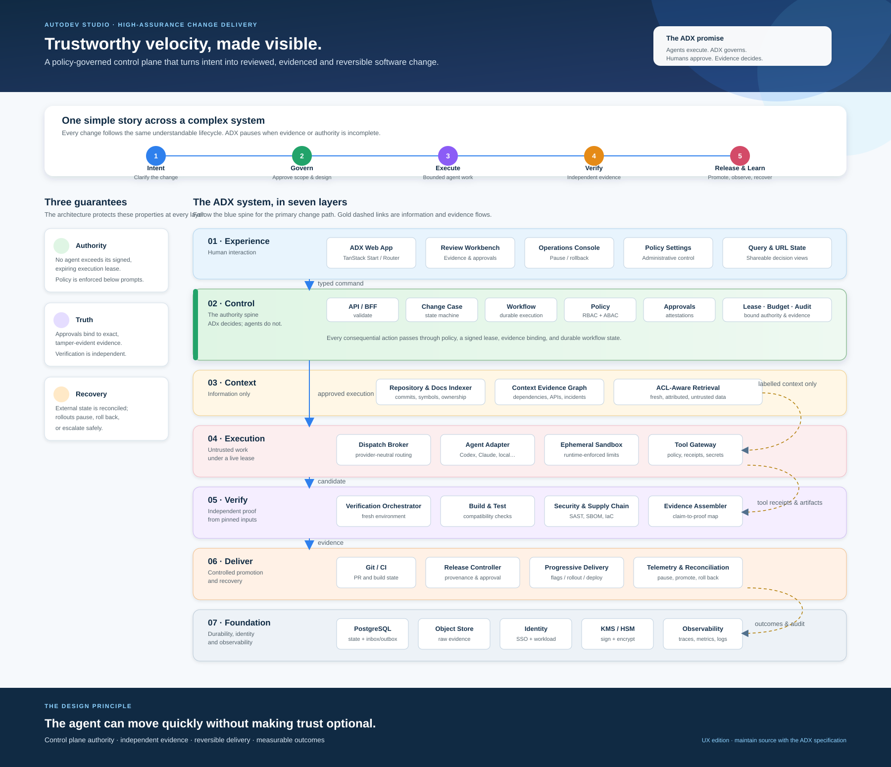

# ADX Architecture — UX Edition

> **Purpose:** a clear, presentation-ready view of how AutoDev Studio (ADX) turns a software-change request into governed, evidenced, reversible delivery.

## Read this diagram in two passes

1. Read the lifecycle ribbon from left to right: **Intent → Govern → Execute → Verify → Release & Learn**. This is the human story of every ADX change case.
2. Then follow the blue vertical spine through the seven system layers. It is the authoritative path for a change: typed command, approved execution, candidate, evidence, and controlled delivery.

ADX deliberately stops rather than guessing when authority, evidence, or safety conditions are incomplete.

## The three guarantees

| Guarantee | What it means in practice |
| --- | --- |
| **Authority** | An agent operates only under a signed, scope-bound, expiring execution lease. Enforcement happens in the control plane and runtime, not in the prompt. |
| **Truth** | Approvals are bound to exact, tamper-evident evidence. Verification is independently produced from pinned inputs. |
| **Recovery** | ADX reconciles external state and can pause, roll back, or escalate a release safely. |

## Layer guide

| Layer | Responsibility | Key idea |
| --- | --- | --- |
| 01 · Experience | Web app, reviews, operational controls, and shareable URL state | People can understand, approve, and intervene. |
| 02 · Control | Change state, durable workflow, policy, approvals, leases, budgets, audit | ADX makes the decisions; agents do not. |
| 03 · Context | Repositories, documentation, evidence graph, ACL-aware retrieval | Context informs work but is not authority. |
| 04 · Execution | Provider-neutral agent adapters, sandboxes, tool gateway | Agent work is bounded and runtime-enforced. |
| 05 · Verify | Builds, tests, security checks, evidence assembly | Claims become independently verifiable proof. |
| 06 · Deliver | Git/CI, release controls, progressive rollout, reconciliation | Promotion is controlled, observable, and reversible. |
| 07 · Foundation | State, evidence storage, identity, keys, observability | The system remains durable, attributable, and auditable. |

## Visual legend

- **Blue solid arrows** — the primary, governed change path.
- **Gold dashed arrows** — context, evidence, receipt, and outcome information flows; they do not confer authority.
- **Green control layer** — the decision and policy boundary for consequential actions.
- **Layer cards** — components are grouped by responsibility, so the reader can understand the architecture without tracing a dense dependency graph.

## Source and maintenance

This page is the accessible, narrative companion to the editable vector asset:

- [UX SVG diagram](adx-layered-component-architecture-ux.svg)
- [Detailed engineering diagram (PlantUML source)](adx-layered-component-architecture.puml)
- [Detailed engineering diagram (SVG export)](adx-layered-component-architecture.svg)

Use the UX SVG in product, leadership, customer, architecture-review, and onboarding material. Use the PlantUML diagram when implementation teams need the fuller component-level map. Keep all three artifacts aligned with the ADX implementation specification.
