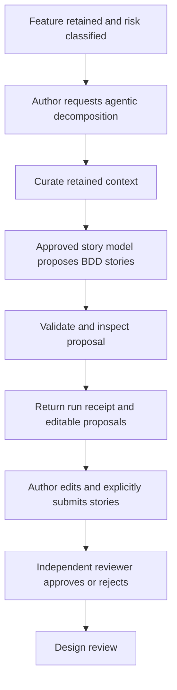

# Agentic Story Decomposition

## Purpose

ADX can use a bounded story-decomposition agent to turn one risk-classified Feature into a small, editable set of user-value Story proposals. The agent is a drafting worker, not a workflow authority. It cannot retain a story revision, approve a story set, change a Change Case state, read a repository, run a shell command, browse the web, or access browser credentials.

The agent is implemented by [apps/adx-api/story-decomposition-agent.mjs](../apps/adx-api/story-decomposition-agent.mjs). It invokes the existing server-configured story model through [apps/adx-api/story-suggestions.mjs](../apps/adx-api/story-suggestions.mjs).

## Operating Model



The model provider may be local Ollama, OpenAI, or Gemini. ADX selects the provider and allows models exclusively from server-side configuration. Browser code never supplies a provider credential.

## Assigned Agent Functions

The agent has exactly four declared functions. They are deliberately narrow and are returned with every run response.

| Function | Authority | Responsibility | Explicit non-authority |
| --- | --- | --- | --- |
| `CURATE_RETAINED_CONTEXT` | Read-only | Select the retained Feature title, outcome, acceptance criteria, target repository, risk tier, asset classifications, approved model choice, and optional author-selected template guidance. | Cannot use unretained browser text, fetch repository context, or resolve an ambiguity by inference. |
| `DRAFT_USER_VALUE_STORIES` | Model call | Call the configured and allowlisted model to propose one to three independently valuable Stories with a concise BDD scenario. | Cannot execute tools, modify a Feature, make a repository change, or select an unapproved model. |
| `INSPECT_STORY_QUALITY` | Read-only | Validate BDD structure, inspect expected user-story narrative form, and report proposal-level findings. | Cannot turn warnings into approval or silently rewrite a submitted Story revision. |
| `ISSUE_RUN_RECEIPT` | Read-only | Return correlation, input, output, and run digests that bind the proposal to the exact bounded request. | Does not write an event, advance state, or claim independent verification. |

## Preconditions

An author may request a decomposition run only when all of the following are true:

1. The Change Case is in `RISK_REVIEW`, `AWAITING_STORY_APPROVAL`, or `DESIGN_REVIEW`.
2. Retained intent includes both an outcome and observable acceptance criteria.
3. There are no retained intake ambiguities with status `OPEN`.
4. The caller is authorized for `resource.write` on the Change Case.
5. The server has a configured story-model provider and an approved model.

The agent rejects missing intent or unresolved ambiguity rather than filling a gap with invented requirements. The author must resolve the retained intake issue before retrying.

## API Contract

The existing endpoint is agent-backed:

```text
POST /v1/workspaces/{workspaceId}/change-cases/{changeCaseId}/story-suggestions
```

Request fields:

```json
{
  "model": "optional server-allowlisted model name",
  "skillId": "optional repository-controlled ADX skill identifier",
  "templateGuidance": "optional plain-text author guidance, maximum 6000 characters"
}
```

The response remains compatible with the Story Workshop because `suggestions` contains the editable Story cards. Agent fields make the origin and limits explicit:

```json
{
  "mode": "AGENTIC_PREVIEW_ONLY",
  "provider": "OLLAMA_LOCAL",
  "model": "approved-local-model",
  "suggestions": [
    {
      "key": "STORY-1",
      "title": "View an authorization decision",
      "narrative": "As a member, I want to view my authorization decision, so that I understand the outcome.",
      "scenarios": [{ "given": "...", "when": "...", "then": "..." }]
    }
  ],
  "agent": {
    "agentId": "adx-story-decomposition-agent",
    "agentVersion": "1.0.0",
    "mode": "BOUNDED_READ_ONLY",
    "functions": []
  },
  "inspection": {
    "validBdd": true,
    "storyDigest": "sha256:...",
    "findingCount": 0,
    "findings": [],
    "authorAction": "Review, edit, and explicitly submit these proposals. This agent run does not retain stories or advance a workflow gate."
  },
  "receipt": {
    "schema": "adx-story-decomposition-agent-run-v1",
    "changeCaseId": "uuid",
    "inputDigest": "sha256:...",
    "outputDigest": "sha256:...",
    "runDigest": "sha256:...",
    "correlationId": "trace-id",
    "providerRequestId": "optional provider request id"
  },
  "authority": {
    "mayPersistStories": false,
    "mayApproveStories": false,
    "mayChangeWorkflowState": false,
    "mayAccessRepository": false,
    "mayExecuteShell": false,
    "mayBrowseNetwork": false,
    "mayAccessBrowserCredentials": false
  }
}
```

Reviewed skills are selected in Story Workshop and are bound to the response receipt by identifier, version, and guidance digest. See [docs/story-decomposition-skills.md](story-decomposition-skills.md) for the catalog, guidance precedence, authority boundary, and skill-authoring process.

The run receipt is a response-level integrity binding, not a durable workflow event. A Story set becomes retained only when the author explicitly uses the existing `POST .../stories` command. That command creates the signed, digest-bound Story revision and moves the case to `AWAITING_STORY_APPROVAL`.

## Human Governance

The agent is not a Story author in the governance model. The authenticated person who reviews, edits, and submits the proposal remains the recorded author. A different authorized reviewer must approve the submitted digest.

| Action | Allowed actor |
| --- | --- |
| Request agent proposal | Authorized Feature author/contributor |
| Edit proposal | Authorized Feature author/contributor |
| Submit retained Story revision | Authorized Feature author/contributor |
| Approve or reject retained Story revision | Independent authorized reviewer, not the Story author |
| Advance into design review | ADX only after an independent approval |

An agent proposal, provider request ID, or a green-looking BDD inspection is never approval evidence.

## Data and Network Boundary

The model receives only the inputs used by the existing story suggestion contract:

- Feature title;
- retained outcome and acceptance criteria;
- target repository identifier;
- risk tier and asset classifications; and
- optional bounded template guidance.

It does not receive full intake source content, session cookies, GitHub credentials, database credentials, repository files, environment secrets, or a developer's local shell context. For Ollama, the configured endpoint must remain loopback-only. For hosted providers, the provider key stays on the API server and the provider request is an outbound service call, not an agent browser capability.

## Failure Handling

| Condition | Result |
| --- | --- |
| No configured model provider | `STORY_AI_NOT_CONFIGURED`; manual authoring remains available. |
| Requested model is not allowlisted | `STORY_AI_MODEL_NOT_ALLOWED`; select an approved model. |
| Provider unavailable or rate limited | Retryable provider error; no Stories are retained. |
| Invalid or incomplete model JSON | `STORY_AI_RESPONSE_INVALID`; no Stories are retained. |
| Open intake ambiguity | `STORY_AGENT_CLARIFICATION_REQUIRED`; resolve retained ambiguity first. |
| Invalid BDD structure | The run fails validation; no Stories are retained. |

No failure changes Change Case state or invalidates a prior approved Story revision.

## Adoption Checklist

1. Configure `ADX_STORY_AI_PROVIDER`, `ADX_STORY_AI_MODEL`, and the relevant server-only provider settings.
2. Limit `ADX_STORY_AI_MODELS` to reviewed models suitable for Feature context.
3. Complete Feature intake and risk classification before opening Story Workshop.
4. Run the agent, inspect the proposal and its warnings, then edit as needed.
5. Submit the selected Story set explicitly.
6. Use an independent reviewer for approval.
7. Treat the signed retained Story revision, not the preview receipt, as the governing artifact for downstream design and execution.

## Verification

Focused behavior is covered by [apps/adx-api/tests/story-decomposition-agent.unit.test.mjs](../apps/adx-api/tests/story-decomposition-agent.unit.test.mjs). It verifies that the agent returns a preview receipt with four bounded functions and no workflow authority, and that it refuses to run when retained intake ambiguity is unresolved.