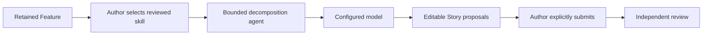

# ADX Studio Story-Decomposition Skills

## Purpose

ADX Studio skills are reviewed, versioned, repository-controlled guidance modules for the bounded story-decomposition agent. A skill changes how the configured model analyzes retained Feature context; it does not grant capabilities, alter authorization, write to a Change Case, or approve a Story set.

The canonical skill catalog is [apps/adx-api/story-decomposition-skills.mjs](../apps/adx-api/story-decomposition-skills.mjs). It is loaded only by the API server, not from browser-provided files or remote URLs.

## Why Skills Belong Here

The Story Workshop is the narrowest useful place to apply skills:

1. The Feature has already completed intake and risk classification.
2. The agent has a small, retained context contract.
3. The author can choose a reviewed approach before drafting.
4. Generated proposals remain editable previews.
5. Independent Story approval remains unchanged.

Skills are therefore analysis guidance at Gate A.5, before any retained Story revision or delivery action exists.



## Built-In Catalog

| Skill ID | Version | Use when | Primary behavior |
| --- | --- | --- | --- |
| `user-journey` | `1.0.0` | A Feature has a clear actor journey and the team needs meaningful end-to-end slices. | Identifies independently valuable user moments and avoids technical-layer stories. |
| `regulated-healthcare` | `1.0.0` | Retained context includes healthcare, consent, clinical accountability, sensitive access, or audit needs. | Emphasizes patient safety, minimum-necessary access, consent, organization scope, accountability, and auditable outcomes. It prohibits invented clinical facts or medical decisions. |
| `delivery-slices` | `1.0.0` | A broad Feature needs small, independently releasable operational or customer outcomes. | Finds releasable vertical slices and rejects database, API, UI, test, or deployment-layer decomposition. |

No skill is selected by default. The author may choose **No reviewed skill** and use the base agent contract alone.

## How Authors Use a Skill

1. Open a Change Case in `RISK_REVIEW` and choose **Story Breakdown**.
2. Choose an approved model.
3. Choose a value from **Choose a reviewed ADX skill**.
4. Optionally upload a plain-text template for one-run supplementary guidance.
5. Select **Run story decomposition agent**.
6. Review the proposed Stories and quality findings, edit as necessary, then explicitly submit the Story set.

The server accepts a skill ID, not skill text:

```json
{
  "model": "approved-model",
  "skillId": "regulated-healthcare",
  "templateGuidance": "optional author guidance for this preview"
}
```

An unknown ID is rejected with `STORY_SKILL_NOT_ALLOWED`. The browser cannot define a new skill, modify the reviewed guidance, or select a server-unregistered version.

## Guidance Precedence

The model request is assembled in this order:

1. **ADX fixed contract**: user-centred, independently valuable, structured JSON/BDD Stories; no invented facts or implementation-layer tasks.
2. **Selected reviewed skill**: repository-controlled guidance for a known decomposition approach.
3. **Optional uploaded template**: temporary author guidance, applicable only when consistent with the first two items and retained context.
4. **Retained Feature context**: title, outcome, acceptance criteria, target repository, risk tier, and asset classifications.

The fixed schema and safety/authority instructions always win. A skill or uploaded template cannot request secrets, change output schema, access a repository, override risk controls, or direct the agent to persist or approve Stories.

## Receipt and Traceability

Every agent run produces a response receipt. When a skill is selected, the receipt includes its stable identity and reviewed-content digest:

```json
{
  "receipt": {
    "schema": "adx-story-decomposition-agent-run-v1",
    "inputDigest": "sha256:...",
    "outputDigest": "sha256:...",
    "runDigest": "sha256:...",
    "skill": {
      "id": "regulated-healthcare",
      "version": "1.0.0",
      "guidanceDigest": "sha256:..."
    }
  }
}
```

The receipt proves which reviewed skill content was selected for that preview. It is not a durable workflow event and is not approval evidence. A Story set becomes a governed artifact only when an authorized person submits it using the existing Story submission command; an independent reviewer must still approve the retained digest.

## Authority and Data Boundaries

Skills supply text guidance only. They never create new tools or broaden the agent's authority.

| Capability | Skill / agent status |
| --- | --- |
| Read retained Feature summary | Allowed through the fixed context contract |
| Call configured story model | Allowed through the server-owned provider client |
| Persist Stories | Denied |
| Approve Stories or change workflow state | Denied |
| Read repository or GitHub data | Denied |
| Execute shell commands | Denied |
| Browse the network | Denied, except the API's configured provider request |
| Access browser session or provider credentials | Denied |

Skills receive no secret, raw intake source, browser cookie, repository file, GitHub token, database credential, or developer shell context. The configured provider receives only the fixed Story-decomposition context and the selected guidance.

## Adding a Skill

Add a definition in `definitions` within [apps/adx-api/story-decomposition-skills.mjs](../apps/adx-api/story-decomposition-skills.mjs). Every definition requires:

```js
{
  id: 'lowercase-kebab-case',
  version: 'semantic-version',
  label: 'Author-facing label',
  description: 'Short selection guidance',
  guidance: 'Reviewed, bounded analysis instructions'
}
```

Review checklist:

1. State the intended decision or decomposition approach clearly.
2. Keep guidance confined to Story analysis, not execution, approval, or delivery.
3. Require retained facts; do not invite invented domain facts.
4. Avoid technical-layer splitting unless the Feature itself requires a separately valuable operational outcome.
5. Do not include provider credentials, URLs, shell commands, external tool requests, or data-access instructions.
6. Bump the version whenever guidance meaning changes. The digest will then change and new run receipts remain distinguishable from prior runs.
7. Add a unit test for both successful selection and rejection of an unknown ID.
8. Update the catalog table in this document.

## Operational Failure Modes

| Condition | Behavior |
| --- | --- |
| No skill selected | The base bounded-agent contract runs normally. |
| Unknown skill ID | The run fails before a provider call with `STORY_SKILL_NOT_ALLOWED`. |
| Open intake ambiguity | The run fails before a provider call with `STORY_AGENT_CLARIFICATION_REQUIRED`. |
| Provider unavailable or output invalid | No Story is retained and no workflow state changes. |
| Skill guidance conflicts with retained context or JSON schema | The fixed contract overrides the conflicting instruction. |

## Validation

[apps/adx-api/tests/story-decomposition-agent.unit.test.mjs](../apps/adx-api/tests/story-decomposition-agent.unit.test.mjs) verifies that the agent applies the selected `user-journey` skill, returns three catalog entries, binds skill ID/version to the receipt, and rejects an unreviewed skill ID.